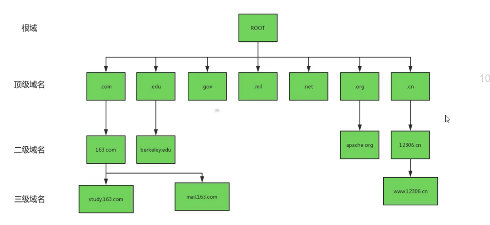
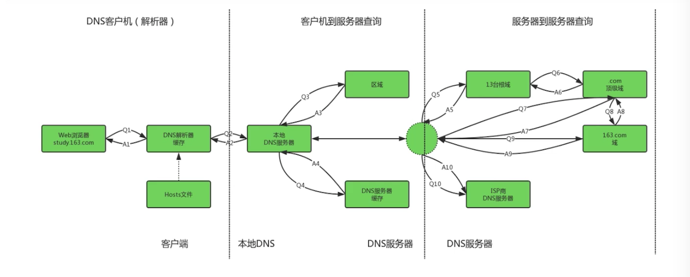

# 通过DNS实现高可靠的负载均衡和访问提速

### DNS简介

DNS(Domain Name Server，域名系统)，其主要作用就是将主机名解析成ip地址的过程，完成了从域名到主机识别ip地址之间的转换。

1. DNS是一个分布式，分层次的主机名管理架构，通过配置DNS服务器地址，主机不需要知道对应的ip地址就能够通过主机名的形式访问互联网。
2. DNS利用类似倒状树的目录结构的管理分配在不同层级的DNS服务器当中，经过分层管理，每一级DNS服务器负责部分域名信息，这就减轻了DNS服务器的负载，同时也方便记录的同步更新。
3. DNS是一个网络服务，因此就有对应的端口，其端口为53号。DNS查询的时候，是以udp这个叫快速的数据传输协议来查询的，但万一没有方法查询到完整的信息时，就会再次以tcp这个协定来重新查询，DNS服务在启动的时候会同时开启tcp的53号端口和udp的53号端口。
4. DNS在进行区域传输的时候使用TCP协议，其它时候则使用UDP协议。
5. FQDN(Full Qualified Domain Name)，完整主机名，是由主机名和域名构成。例如www.baidu.com，当中，www就是web网站服务器的主机名，baidu.com就是域名，主机名和域名之间用实心点号来表示。
6. DNS时基于c/s架构(多数基于套接字架构C/S架构)，对于每一级域名长度的限制时63个字符，域名总长度则不超过253个字符。
7. DNS系统记录的信息非常多，不过重点就两个，一个记录服务器所在的NS标志，另一个记录主机名对应的address标志。

DNS的域名结构。

1. DNS的域名时倒状的树状结构，在最顶层的是一个根服务器，它主要负责顶级域名的管理。
2. 一级域名共分为三类，组织域，国家域和反响域，最多可以有127级域名。
3. 每一级的域名服务器只负责对应夏季的域的管理，其中根节点时分布在世界各地的13台服务器组成，其中10台位于美国地区，另外3台设置于英国，瑞典和日本。

### DNS工作原理

DNS解析域名到IP要经过三个阶段：

1. 本地DNS缓存解析。
2. 本地DNS服务器解析，递归查询。
3. 根域级各级域名服务器解析，迭代查询。

### DNS负载均衡

DNS负载均衡技术的实现原理是：在DNS服务器中为同一个主机名配置多个IP地址，多个IP地址以轮询的方式选择。

### DNS与其它负载均衡工具对比

1. DNS负载均衡。

   对同一个请求的域名，映射为不同的服务器IP地址。

2. HTTP重定向。

   HTTP代理向Web服务器请求某一个url后，Web服务器根据http响应头信息中的location标记来返回一个新的url，然后http代理继续请求访问这个新的url。

3. 反向代理负载均衡。

   反向代理指的是以代理服务器来接收对Web服务器的连接请求，然后转发给内部网络中不同的Web服务器，并将从Web服务器请求得到的结果返回给请求连接的客户端。

4. NAT负载均衡。

   将公网地址映射为多个私网地址，解决IP地址紧张，不想让外部网络知道内部网络结构的问题。

5. CDN。

   内容分发网络。通过发布机制将内容同步到大量的缓存节点，并在DNS服务器上进行扩展，找到里用户最近的缓存节点作为服务提供节点。

6. 混合型负载均衡。

   在有些大型网络，由于多个服务器群内硬件设备，各自的规模，提供的服务等的差异，可以考虑给每个服务器群采用最合适的负载均衡方式，然后又在这个多个服务器群间再一次负载均衡或集群起来以一个整体向外界提供服务(即把这多个服务器群当做一个新的服务器群)，从而达到最佳的性能。