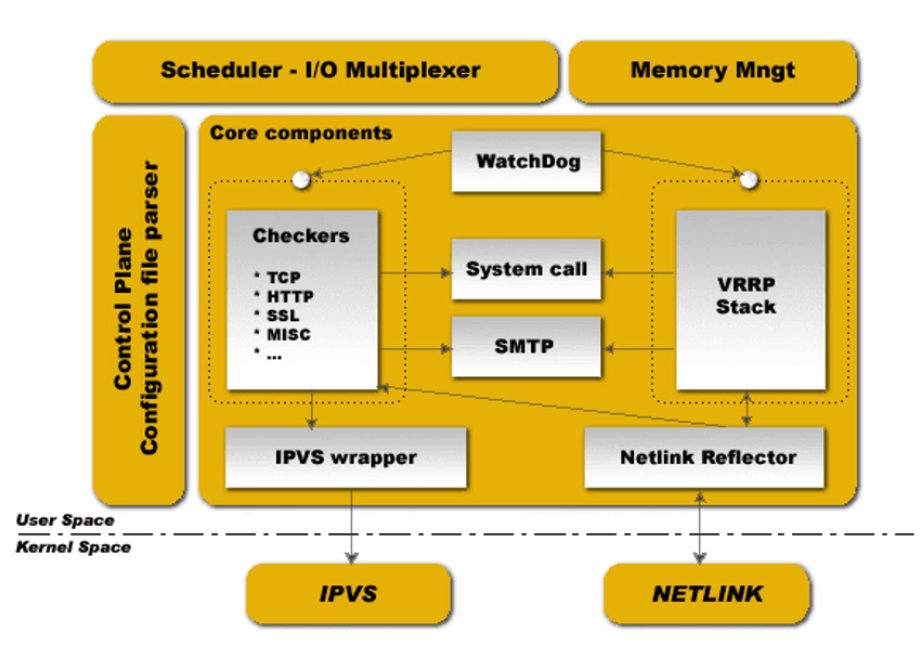
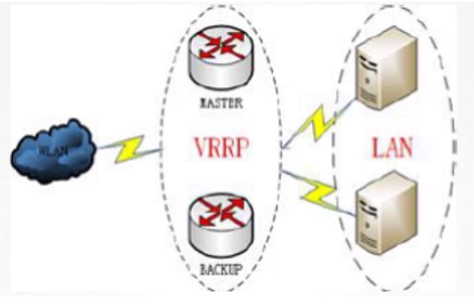
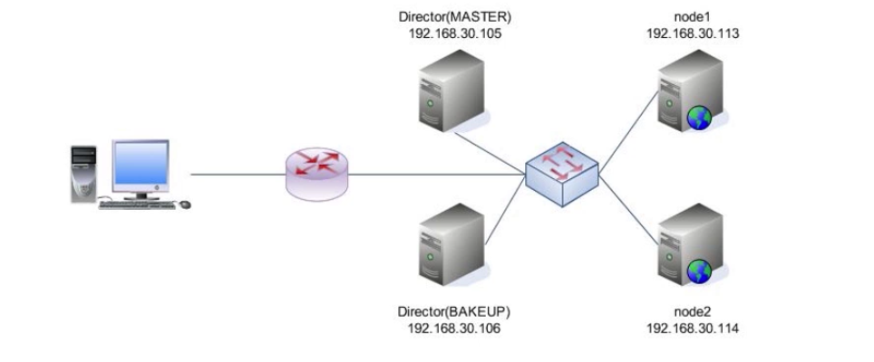
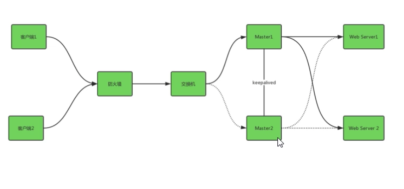
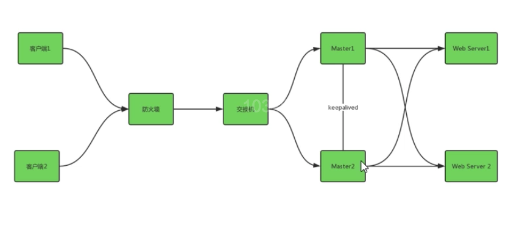
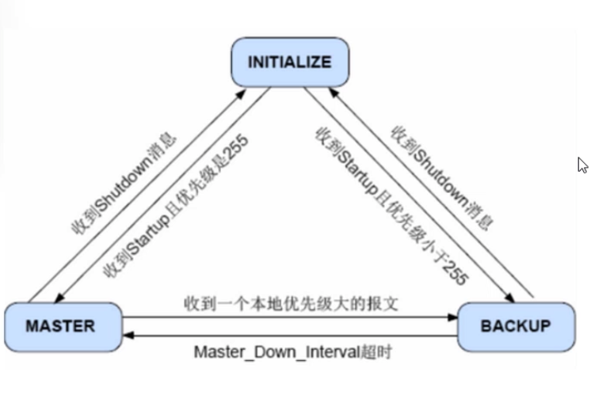

### 基于VIP的keepalived

### keepalived简介

1. keepalived的作用是检测服务器的状态。如果有一台服务器宕机，或工作出现故障，keepalived将检测到，并将有故障的服务器从系统中剔除，同时使用其他服务器代替该服务器的工作，当服务器工作正常后keepalived自动将服务器加入到服务器集群中，这些工作全部自动完成，不需要人工干涉，需要人工做的只是修复故障的服务器。
2. keepalived特性。
   * 配置文件简单：配置文件比较简单，可通过简单配置实现高可用功能。
   * 稳定性强：keepalived是一个类似于layer3/4/7交换机机制的软件，具备我们平时所的第3层，第4层，第7层交换机的功能，常用于前端负载均衡器的高可用服务，挡住服务器出现故障时，可快速进行切换，监测机制灵活，成功率高。
   * 成本低廉：开源软件，可直接下载配置使用，没有额外费用。
   * 应用范围广：因为keepalived可应用在多个层面，所以它几乎可以对所有应用做高可用，包括LVS，数据库，http服务，nginx负载均衡等等。
   * 支持多种类型：支持主从模式，主主模式高可用，可根据业务场景灵活选择。

### keepalived工作原理

1. keepalived内部工作分为以下几个部分：
   * WatchDog监控checkers和VRRP进程的状态。
   * Checkers负责真实服务器的健康检查health checking。
   * VRRP Stack负责负载均衡器之间的失败切换。
   * IPVS wrapper用来发送设定的规则到内核IPVS代码。
   * Netlink Reflector用来设定vrrp的vip地址等。

2. keepalived是以VRRP协议为实现基础的，VRRP全称Virtual Router Redundancy Protocol，即虚拟路由冗余协议。VRRP根据优先级确定虚拟路由器中每台路由器的角色(Master路由器或Backup路由器)。VRRP优先级的取值范围为0到255(数值越大表明优先级越高)，可配置的范围是1到254，优先级0位系统保留给路由器放弃Master位置时使用，255则是系统保留给IP地址拥有者使用。优先级越高，则越有可能成为Master路由器。当两台优先级相同的路由器同时竞争Master时，比较接口IP地址大小。接口地址大者当选为Master。

   

3. keepalived主要有三个模块，core，check和vrrp。

   * core模块：keepalived的核心，负责主进程的启动，维护以及全局配置文件的加载和解析。
   * check模块：负责健康检查，包括常见的各种检查方式。
   * vrrp模块：是来实现VRRP协议的。

### keepalived应用场景

1. 在网络层，数据链路层，运行着4个重要的协议：

   * IP：互联网协议。
   * ICMP：互联网控制报文协议。
   * ARP：地址转换协议。
   * RARP：反向地址转换协议。

2. 网络层场景。

   keeepalived在网络层采用的最常见的工作方式是通过ICMP协议向服务器集群的那个节点发送一个ICMP数据包(类似于ping实现的功能)，如果某个节点没有返回响应数据包，那么认为此节点发生了故障，keepalived将报告此次节点失效，并从服务器集群中剔除故障节点。

3. 传输层场景。

   在传输层，提供了两个主要的协议：传输控制协议TCP和用户数据报协议UDP。传输控制协议TCP可以提供可靠的数据传输服务，IP地址和端口代表TCP的一个连接端。要获得TCP服务，需要在发送机的一个端口上和接收机的一个端口上建立连接。

   keepalived在传输层就是利用TCP协议的端口连接和扫描技术来判断集群点是否正常的。比如，对于常见的web服务默认的80端口，SSH服务默认的22端口等，keepalived一旦在传输层探测到这些端口没有响应数据返回，就认为这些端口发生异常，然后强制将此端口对应的节点从服务器集群中移除。

4. 应用层场景。

   在应用层，可运行FTP，TELNET，HTTP，DNS等各种不同类型的高层协议。keepalived在应用层的运行方式也更加全面化和复杂化，用户可以通过自定义keepalived的工作方式；例如：用户可以通过编写程序来运行keepalive。而keepalived将根据用户设定检测各种程序或服务是否运行正常，如果keepalived的检测结果与用户设定不一致时，keepalived将把对应的服务从服务器中移除。

### 集群

1. 集群是一组相互独立的，通过高速网络互联的计算机。它们构成了一个组，并以单一系统的模式加以管理。一个客户与集群相互作用时，集群像是一个独立的服务器。

2. 通过集群技术，可以在付出较低成本的情况下获得在性能，可靠性，灵活性方面的相对较高的收益，其任务调度则是集群系统中的核心技术。

3. 集群组成后，可以利用多个计算机和组合进行海量请求处理(负载均衡)，从而获得很高的处理效率，也可以用多个计算机做备份(高可用)，使得任何一个机器坏了整个系统还是能正常运行。集群在目前互联网公司是必备的技术，极大提高互联网业务的可用性和可伸缩性。

   

### 高可用

1. HA，高可用性集群是通过系统的可靠性和可维护性来度量的。
2. 工程上，通常用平均无故障时间(MTTF)来度量系统的可靠性，用平均维修时间(MTTR)来度量系统的可维护性。于是可用性被定义为：HA=MTTF(MTTF+MTTR)*100%(平均无故障时间/总时间，总时间=平均无故障时间+平均维修时间)。宕机事件不超过6分钟。
3. 具体HA衡量标准：
   * 99%一年宕机时间不超过4天。
   * 99.9%一年宕机时间不超过10小时。
   * 99.99%一年宕机时间不超过1小时。
   * 99.999%一年宕机时间不超过6分钟。

### 高可用集群实现

1. 高可用工作方式。

   * 主从方式(非对称方式)。
   * 双机双工(互备互援)。
   * 集群工作方式(多服务器互备方式)。

2. 高可用资源分类：

   * 网络高可用。
   * 服务器高可用。
   * 存储高可用。
   * 服务高可用。

   keepalived通过实现vrrap协议来实现地址飘移。

### 高可用架构

1. 主从高可用架构。

   * 在系统中，有一个Master节点和一个Backup节点，其中Master节点对线上业务提供服务，Backup与Master节点之间保持心跳。
   * 当Master节点因宕机服务不可用时，系统会切换到Backup节点上线，提供服务。
   * 当宕机Master节点恢复后，系统将该Master作为Backup加入集群。

   

2. 双主高可用架构。

   * 在系统中，有两个Master节点，均对线上业务提供服务，两个Master节点之间保持心跳。
   * 当某一台Master节点因宕机服务不可用时，系统会将流量全部导向剩余的Master节点，继续提供服务。
   * 当宕机的Master节点恢复后，系统将该Master加入集群，提供服务。

   

### keepalived高可用集群的解决方案

1. keepalived在一个节点上启动之后，会生成一个Master主进行，这个主进程又会生成两个子进程，分别是：

   * VRRP Stack：实现VRRP协议。
   * Checkers：检测ipvs后端realserver的健康状况。

2. VRRP双方节点都启动以后，要实现状态转换的，则开始启动的时候，初识状态都是BACKUP，而后向其它节点发送通知，以及自己的优先级信息，谁的优先级高，就转换为MASTER，否则就还是BACKUP。

3. 这时候服务就在状态为MASTER的节点上启动，为用户提供服务，如果，该节点挂掉了，则转换为BACKUP，优先级降低，另一个节点转换为MASTER，优先级上升，服务就在此节点启动，VIP，VMAC都会被转移到这个节点上，为用户提供服务。

   

   