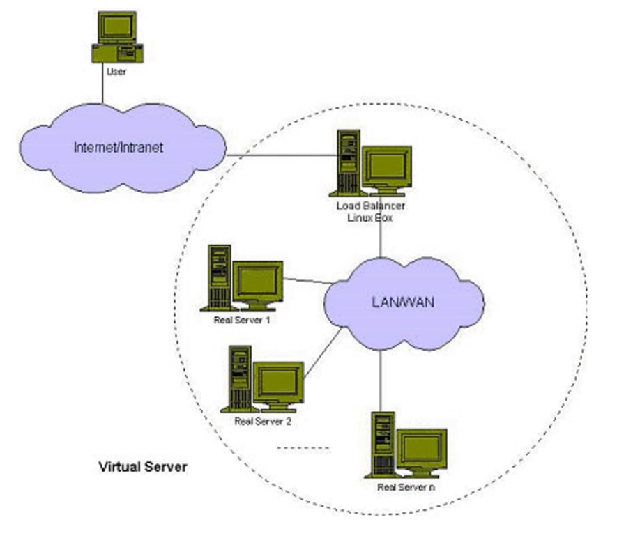
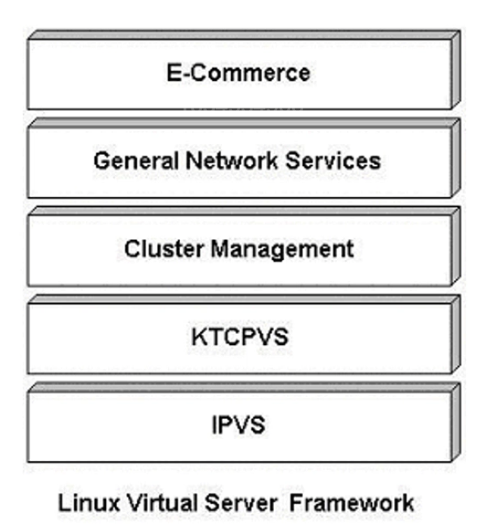
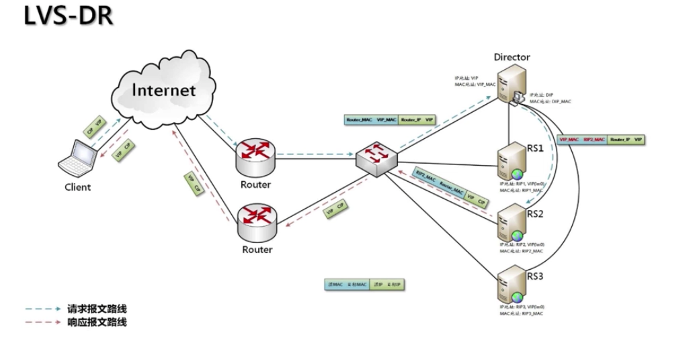
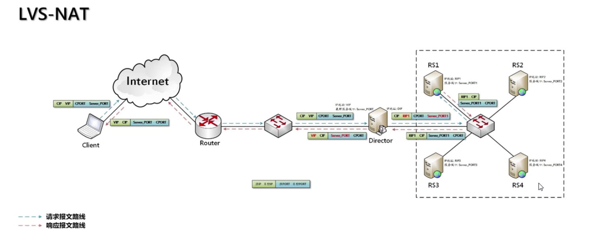
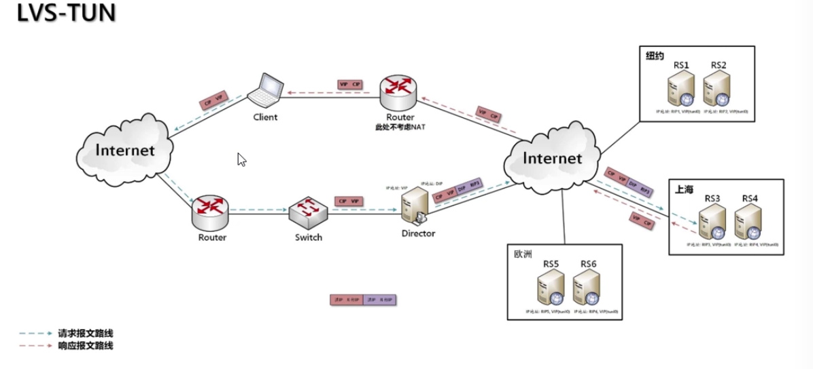
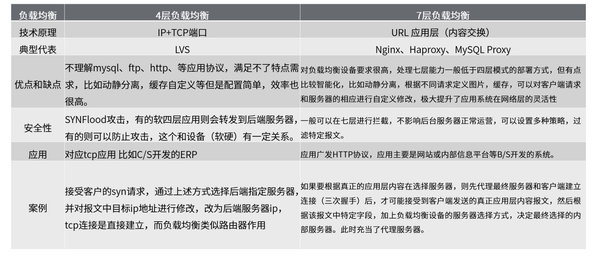

# LVS基础概念

### LVS简介

1. LVS是什么？

   LVS的英文全称是Linux Virtual Server，即Linux虚拟服务器。它是我们国家的章文嵩博士的一个开源项目。在linux内核2.6中，它已经成为内核的一部分，在此之前的内核版本则需要重新编译内核。

2. LVS能干什么？

   LVS主要用于多服务器的负载均衡。它工作在网络4层，可以实现高性能，高可用的服务器集群技术。它廉价，可把许多低性能的服务器组合在一起形成一个超级服务器。它易用，配置非常简单，且有多种负载均衡的方法。它稳定可靠，即使在集群的服务器中某台服务器无法正常工作，也不影响整体效果。另外可扩展性也非常好。

### Linux Virtual Server项目

1. 针对高可伸缩，高可用网络服务的需求，我们给出了基于IP层和基于内容请求分发的负载均衡调度解决方法，并在Linux内核中实现了这些方法，将一组服务器构成一个实现可伸缩的，高可用网络服务的虚拟服务器。

2. 虚拟服务器体系结构如下图所示，一组服务器通过高速的局域网或者地理分布的广域网相互连接，在它们的前端有一个负载调度器。负载调度器能够无缝地将网络请求调度到真实服务器上，从而使得服务器集群的结构对客户是透明的，客户访问集群系统提供的网络服务就像访问一个高性能，高可用的服务器一样。由于我们的负载调度技术是在Linux内核中实现的，我们称之为Linux虚拟服务器。

   

3. Linux Virtual Server项目的目标：使用集群技术和Linux操作系统实现一个高性能，高可用服务器，它具有很好的可伸缩性，可靠性和可管理性。

4. 目前，LVS项目已经提供了一个实现可伸缩网络服务的Linux Virtual Server框架，如下图所示。

   * IPVS：提供了含有三种IP负载均衡技术的IP虚拟服务器软件。
   * KTCPVS：基于内容请求分发的内核Layer-7交换机。
   * Cluster Management：集群管理软件。

   

5. 可以利用LVS框架实现高可伸缩的，高可用的Web，Cache，Mail和Media等网络服务；在此基础之上，可以开发支持庞大用户数的，高可伸缩的，高可用的电子商务应用。

### 网络分层

1. 网络7层。

   7层是指OSI七层协议模型，主要是：物理层，数据链路层，网络层，传输层，会话层，表示层，应用层。Nginx工作在7层网络模型下。

2. 网络5层。

   5层只是OSI和TCP/IP的综合，是业界产生出来的非官方协议模型，但是有很多具体的应用。实际应用还是TCP/Ip的四层结构。为了方便可以把下两层称为网络接口层。五层体系结构包括：物理层，数据链路层，网络层，传输层，应用层。

3. 网络4层。

   4层是指TCP/IP四层模型，主要包括：网络接口层，网际层，运输层，应用层。

### IP虚拟服务器软件IPVS

在调度器的实现技术中，IP负载均衡技术是效率最高的。IPVS软件实现了三种IP负载均衡技术，它们的大致原理如下：

1. Virtual Server via Direct Routing(VS/DR)

   VS/DR通过改写请求报文的MAC地址，将请求发送到真实服务器，而真实服务器将响应直接返回给客户。同VS/TUN技术一样，VS/DR技术可极大地提高集群系统的伸缩性。这种方法没有IP隧道的开销，对集群中的真实服务器也没有必须支持IP隧道协议的要求，但是要求调度器与真实服务器都有一块网卡连在统一物理网段上。

   

2. Virtual Server via Network Address Translation(VS/NAT)。

   通过网络地址转换，调度器重写请求报文的目标地址，根据预设的调度算法，将请求分派给后端的真实服务器；真实服务器的响应报文通过调度器时，报文的源地址被重写，再返回给客户，完成整个负载调度过程。

   

3. Virtual Server via IP Tunneling(VS/TUN)。

   采用NAT技术时，由于请求和响应报文都必须经过调度器地址重写，当客户请求越来越多时，调度器的处理能力将成为瓶颈。为了解决这个问题，调度器把请求报文通过IP隧道转发至真实服务器，而真实服务器将响应直接返回给客户，所以调度器只处理请求报文。由于一般网络服务应答比请求报文大许多，采用VS/TUN技术后，集群系统的最大吞吐量可以提高10倍。

   

   **VS/TUN和VS/DR的区别？**

### IPVS调度算法

针对不同的网络服务需求和服务器配置，IPVS调度器实现了如下八种负载调度算法：

1. 轮叫，Round Robin。
2. 加权轮叫，Weighted Round Robin。
3. 最少链接，Least Connections。
4. 加权最少链接，Weighted Least Connections。
5. 基于局部性的最少链接，Locality-Based Least Connections。单台服务器。
6. 带复制的基于局部性的最少链接，Locality-Based Least Connections with Replication。服务器集群。
7. 目标地址散列，Destination Hashing。
8. 源地址散列，Source Hashing。

### 内核Layer-7交换机KTCPVS

1. 在基于IP负载调度技术中，当一个TCP连接的初识SYN报文到达时，调度器就选择一台服务器，将报文转发给它。此后通过查发报文的IP和TCP报文头地址，保证此连接的后继报文被转发到该服务器。这样，IPVS无法检查到请求的内容在选择服务器，这就要求后端服务器组提供相同的服务，不管请求被发送到哪台服务器，返回结果都是一样的。但是，在有些应用中后端服务器功能不一，有的提供HTML文档，有的提供图片，有的提供CGI，这就需要基于内容的调度。

2. 由于用户空间TCP Gateway的开销太太大，我们提出在操作系统的内核中实现Layer-7交换方法，来避免用户空间与核心空间的切换和内存复制的开销。在Linux操作系统的内核中，我们实现了Layer-7交换，称之为KTCPVS(Kernel TCP Virtual Server)。

   虽然应用层交换处理复杂，它的伸缩性有限，但应用层交换带来以下好处：

   * 相同页面的请求被发送到同一台服务器，可以提高单台服务器的Cache命中率。
   * 一些研究表明web访问流量中存在局部性。Layer-7交换可以充分利用访问的局部性，将相同类型的请求发送到同一台服务器，使得每台服务器收到的请求具有更好的相似性，可进一步提高单台服务器的Cache命中率。
   * 后端服务器可运行不同的服务，如文档服务，图片服务，CGI服务和数据库服务。

### LVS集群特点

功能

1. 有实现三种IP负载均衡技术和八中连接调服算法的IPVS软件。
2. 在IPVS内部实现上，采用了高效的Hash函数和垃圾回收机制，能正确处理所调度报文相关的ICMP消息。
3. 虚拟服务的设置数目没有限制，每个虚拟服务有自己的服务器集。
4. 它支持持久的虚拟服务，(如HTTP Cookie和HTTPS等需要该功能的支持)，并提供详尽的统计数据，如连接的处理速率和报文流量等。
5. 针对大规模拒绝服务(Deny of Service)攻击，实现了三种防卫策略。
6. 有基于内容请求分发的应用层架换软件KTCPVS，它也是在Linux内核中实现。
7. 有相关的集群管理软件对资源进行监测，能及时将故障屏蔽，实现系统的高可用性。
8. 主，从调度器能周期行地进行状态同步，从而实现更高的可用性。

适用性

1. 后端服务器可运行任何支持TCP/IP的操作系统，包括Linux，各种Unix(如FreeBSD，Sun Solaris，HP Unix等)，Mac/OS和Windows NT/2000等。负载调度器能够支持绝大多数的TCP和UDP协议。

性能

1. LVS服务器集群系统具有良好的伸缩性，可支持几百万个并发连接。配置100M网卡，采用VS/TUN或VS/DR调度技术，集群系统的吞吐量可高达1Gbits/s；如配置千兆网卡，则系统的最大吞吐量可接近10Gbits/s。

可靠性

1. LVS服务器集群软件已经在很多大型的，关键性的站点得到很好的应用，所以它的可靠性在真实应用得到很好的证实。有很多调度器运行一年多，未作一次重启。

软件许可证

1. LVS集群软件是按GPL(GNU Public License)许可证发行的自由软件，这意味着你可以得到软件的源代码，有权对其进行修改，但必须保证你的修改也是以CPL方式发行。

### LVS与Nginx对比

### 问题

**VS/TUN和VS/DR的区别？**

