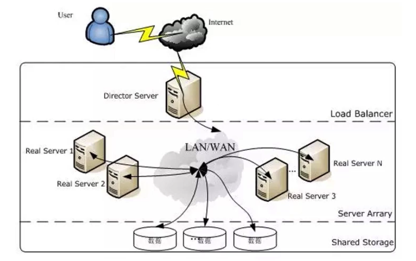
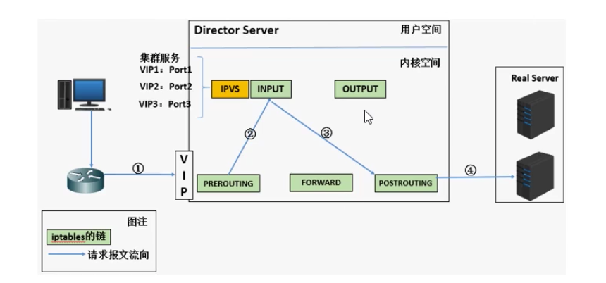
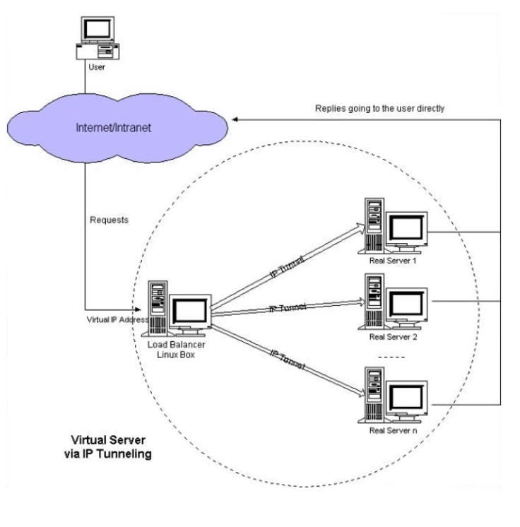
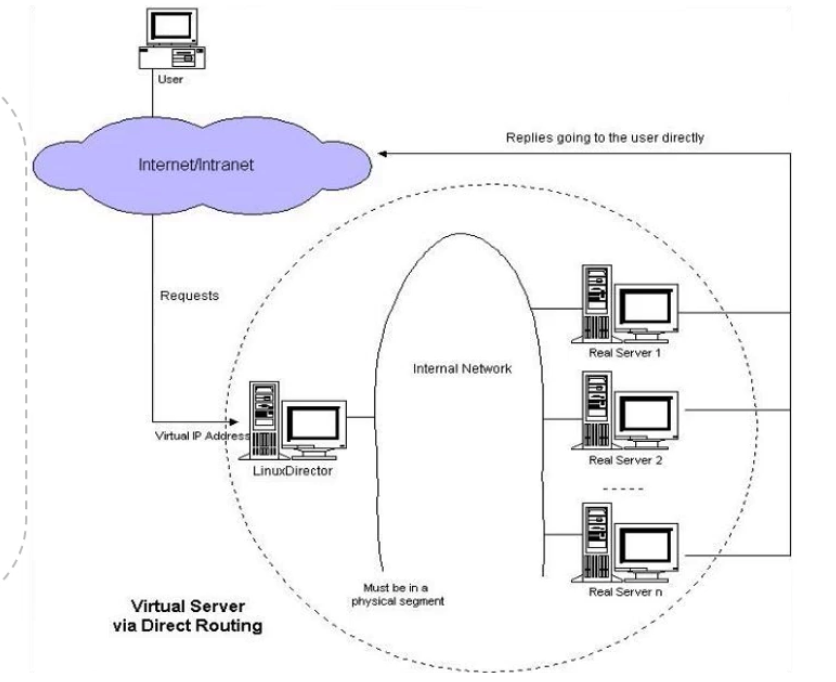
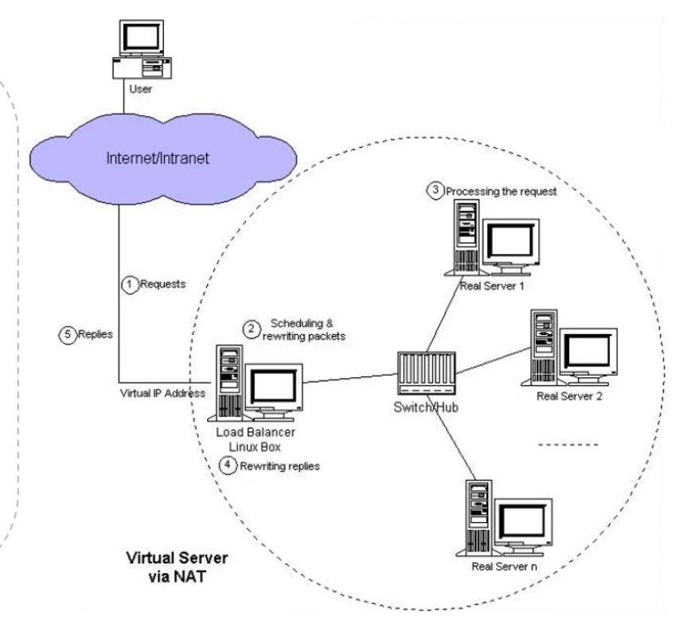

# 搭建LVS负载均衡

### 负载均衡集群介绍

1. 主流开源软件LVS，keepalive，haproxy，nginx等。
2. LVS属于4层负载均衡，Nginx属于7层负载均衡，Haproxy既可以认为是4层，也可以做7层使用。
3. LVS这种4层的负载均衡是可以分发除80外的其它端口通信的，比如MySQL的，而Nginx仅仅支持HTTP，HTTPS，MAIL；Haproxy也会吃MySQL这种。
4. 相比较来说，LVS这种4层的更稳定，能承受更多的请求，而Nginx这种7层的更加灵活，能够实现更多的个性化需求。

### LVS简介

1. LVS是由国人章文嵩开发。

2. LVS是基于TCP/IP做的路由和转发，稳定性和效率很高。

3. LVS时工作在Linux内核中的。

4. LVS又三种常见的模式：NAT，DR，IP Tunel。

5. LVS架构中有一个核心角色叫做分发器，它用来分发用户的请求。

   

   一个LVS集群往往包含以下角色：

   1. DS：Direct Server。指的是前端负载均衡器节点。

   2. RS：Real Server。后端真实的工作服务器。

   3. VIP：向外部直接面向用户请求，作为用户请求的目标的IP地址。

   4. DIP：Director Server IP，主要用户和内部主机通信的IP地址。

   5. RIP：Real Server IP，后端服务器的IP地址。

   6. CIP：Client IP，访问客户端的IP地址。

      

### LVS IP Tunnel模式

1. 这种模式需要有一个公共的IP配置在分发器和所有的RS上，我们把它叫作VIP。
2. 客户端请求的目标IP为VIP，分发器接收到请求的数据包后，会对数据包做一个加工，会把目标IP改为RS的IP，这样数据包就到了RS上。
3. RS接收数据包后，还还原原始数据包，这样目标IP为VIP，因为所有RS上配置了这个VIP，所以它会认为是它自己。

### LVS DR模式

1. 这种模式，也需要有一个公共的IP配置在分发器和所有RS上，也就是VIP。
2. 和IP Tunnel不同的是，它会把数据包的MAC地址修改为RS的MAC地址。
3. RS接收数据包后，会还原原始数据包，这样目标IP为VIP，因为所有RS上配置了这个VIP，所以它会认为是它自己。

### LVS NAT模式

1. 这种模式借助iptables的nat表来实现。
2. 用户的请求到分发器后，通过预设的iptables规则，把请求的数据包转发到后端的RS上去。
3. RS需要设定网关为分发器的内网IP。
4. 用户请求的数据包和返回给用户的数据包全部经过分发器，所以分发器成为瓶颈。
5. 在nat模式中，只需要分发器有公网IP即可，所以比较节省公网IP资源。

