# RabbitMQ集群和高可用

### 应用管理

1. rabbitmqctl status：查看节点状态。
2. rabbitmqctl stop [pid_file]：停止运行RabbitMQ的Erlang虚拟机和RabbitMQ服务应用。如果指定了pid_file，还需要等待指定进程的结束。pid_file是通过调用rabbitmq-server命令启动RabbitMQ服务时创建的，默认情况下存放于Mnesia目录中。如果使用rabbitmq-server -detach这个带有-detach后缀的命令来启动RabbitMQ服务则不会生成pid_file文件。
3. rabbitmqctl stop_app：停止RabbitMQ服务应用，但是Erlang虚拟机还是处于运行状态。此命令的执行优先于其他管理操作(这些管理操作需要先停止RabbitMQ应用)，比如rabbitmqctl reset。
4. rabbitmqctl start_app：启动RabbitMQ应用。此命令典型的用途是在执行了其他管理操作之后，重新启动之前停止的RabbitMQ应用，比如rabbitmqctl reset。
5. rbbitmqctl reset：将RabbitMQ节点重置还原到最初的状态。包括从原来所在的集群中删除此节点，从管理数据库中删除所有的配置数据，如已配置的用户，vhost等，以及删除所有的持久化消息。执行rabbitmqctl reset命令前必须停止RabbitMQ应用(比如先执行rabbitmqctl stop_app)。
6. rabbitmqctl force_reset：强制将RabbitMQ节点重置还原到最初状态。此命令不论当前管理数据库的状态和集群配置是什么，都会无条件地重置节点，只能在数据库或集群配置已损坏的情况下使用。

### 集群管理

1. rabbitmqctl -n nodename join_cluster {cluster_node} [—ram]：将节点加入指定集群中。在这个命令执行前需要停止RabbitMQ应用并重置节点。

   * -n nodename：指定需要操作的目标节点，例如：rabbit@node1。
   * cluster_node：需要加入的集群节点名，格式同上。

   * —ram：集群节点类型，有两种类型：ram|disc，默认为disc。

     ram：内存节点，所有元数据都存储在内存中。

     disc：磁盘节点，所有的元数据都存储在磁盘中。

2. rabbitmqctl cluster_status：查看集群状态。

3. rabbitmqctl change_cluster_node_type {disc|ram}：修改集群节点的类型，使用此命令前要停止RabbitMQ应用。

4. rabbitmqctl forget_cluster_node [—offline]：将节点从集群中删除，允许离线执行。

5. rabbitmqctl update_cluster_nodes {clusternode}：在集群中的节点应用启动前咨询clusternode节点的最新信息，并更新相应的集群信息。这个和join_cluster不同，它不加入集群。

6. rabbitmqctl force_boot：确保节点可以启动，即使它不是最后一个关闭的节点。通常我们在运维的时候，如果一个集群宕掉，会从最后一个宕掉的机器重启，但如果同时宕掉就只能使用这种方式先启动其中一台。

7. rabbitmqctl set_cluster_name {name}：设置集群名称。集群名称在客户端连接时会通报给客户端。集群名称默认时集群中第一个节点的名称，通过这个命令可以重新设置。

## RabbitMQ高可用集群方案

RabbitMQ的Cluster模式分为两种：普通模式和镜像模式。

### Cluster普通模式

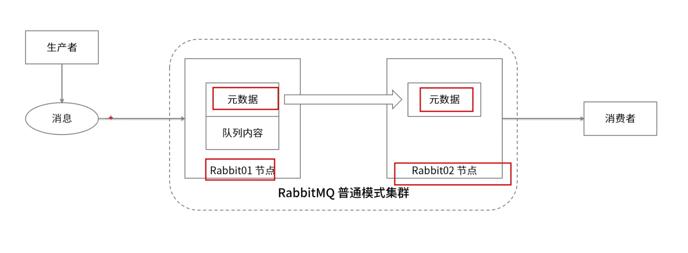

1. 元数据包含以下内容：
   * 队列元数据：队列的名称及属性。
   * 交换器：交换器的名称及属性。
   * 绑定关系元数据：交换器与队列或者交换器与交换器。
   * vhost元数据：为vhost内的队列，交换器和绑定提供命名空间及安全属性之间的绑定关系。

### Cluster多机多节点部署

1. 多机多节点是指在每台机器中部署一个RabbitMQ服务节点，劲儿由多台机器组成一个RabbitMQ集群。

   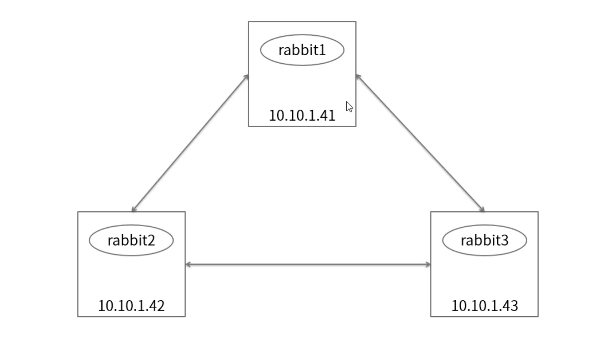

2. 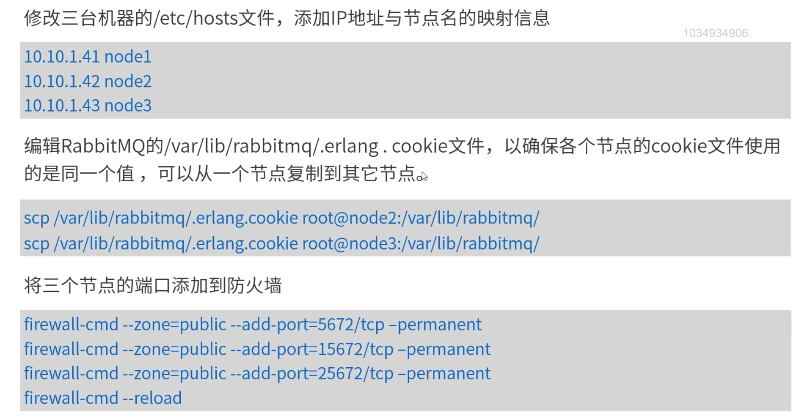

### Cluster单机多节点部署

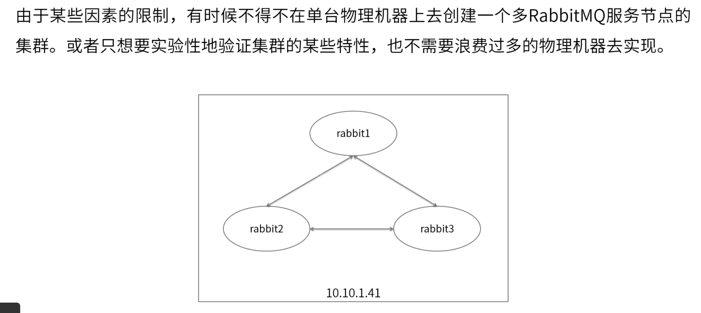

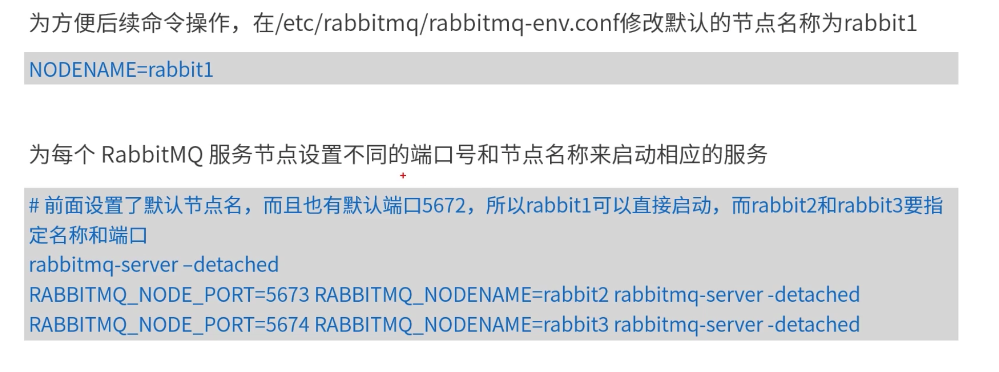

### Cluster镜像模式

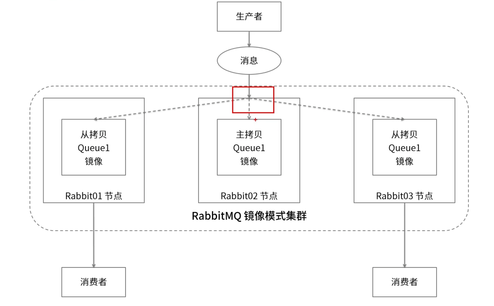

1. 镜像模式的集群是在普通模式的基础上，通过policy来实现，使用镜像模式可以实现RabbitMQ的高可用方案。

   * Name：policy的名称。

   * Pattern：匹配表达式。

   * Apply to：规则应用到哪个目标。

   * Priority：优先级。

   * Definition：规则定义，对于镜像队列的配置来说，只需要包含上三个部分：ha-mode，ha-params和ha-sync-mode。

     

   

2. ha-mode

   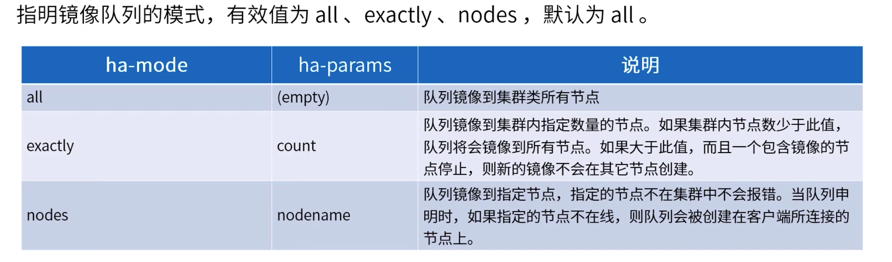

3. ha-sync-mode：队列中消息同步方式，有效值为automatic和manual，默认时automatic。

### Federation

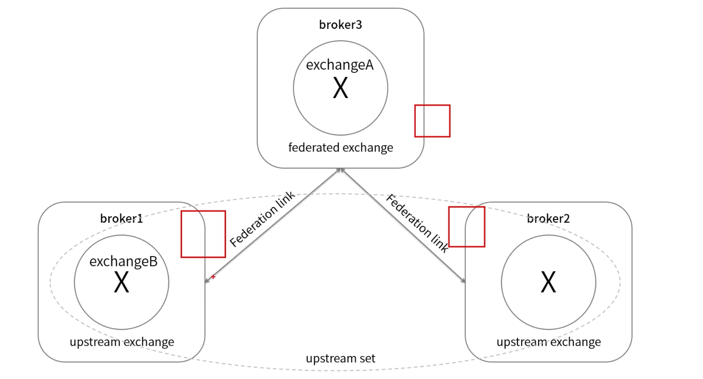

### Shovel插件

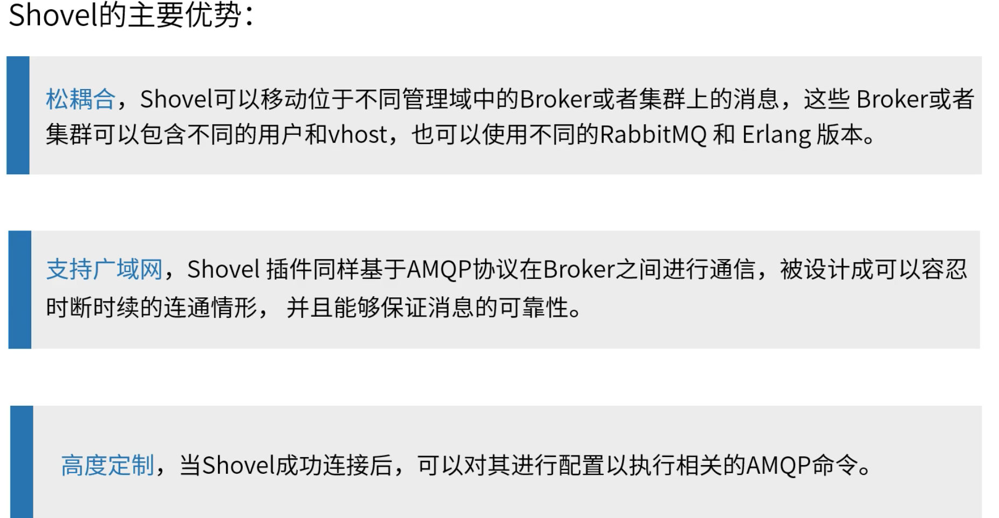

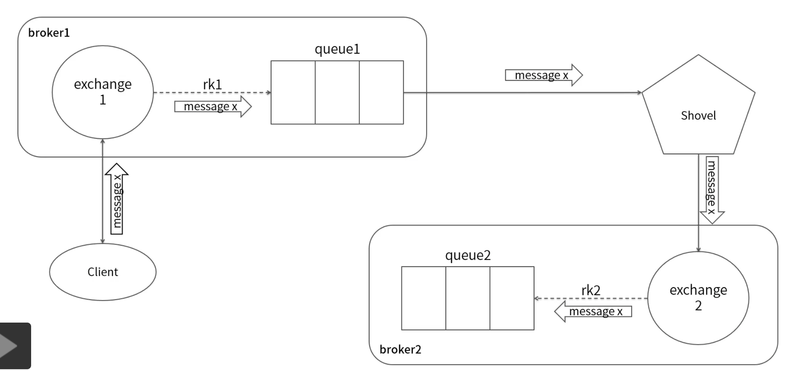

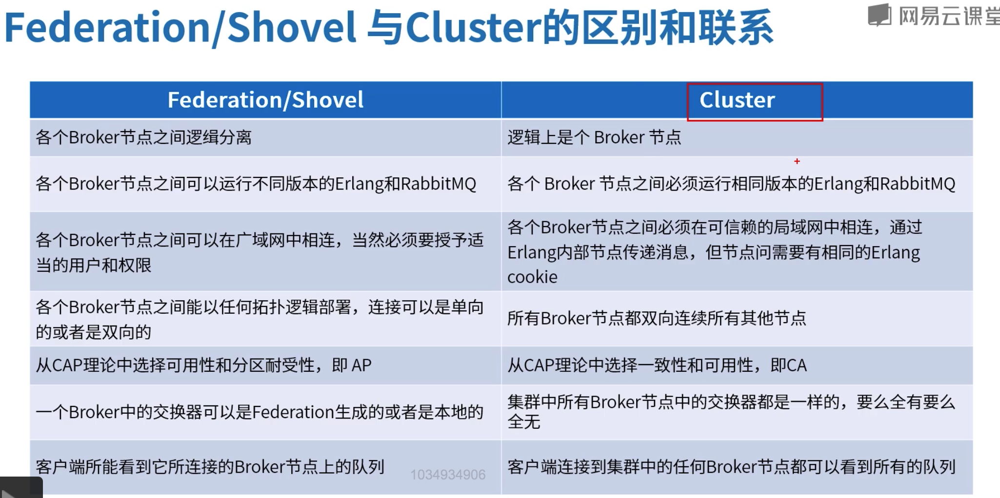

