# RabbitMQ入门

## RabbitMQ角色

1. RabbitMQ的角色用户分类：none，management，policymaker，monitoring，administrator
2. none：不能访问management，plugin
3. Management：用户可以通过AMQP做任何事外加：
   * 列出自己可以通过AMQP登入的virtual hosts。
   * 查看自己的virtual hosts中的queues，exchanges和bindings。
   * 查看和关闭自己的channels和connections。
   * 查看有关自己的virtual hosts的全局的统计信息，包含其他用户在这些virtual hosts中的活动。
4. Policymaker：management可以做的任何事外加：
   * 查看，创建和删除自己的virtual hosts所属的policies和parameters。
5. Monitoring：management可以做的任何事外加：
   * 列出所有virtual hosts，包括他们不能登陆的virtual hosts。
   * 查看其他用户的connections和channels。
   * 查看节点级别的数据如clustering和memory使用情况。
   * 查看真正的关于所有virtual hosts的全局的统计信息。
6. Administrator：policymaker和monitoring可以做的任何事外加：
   * 创建和删除virtual hosts。
   * 查看，创建和删除users。
   * 查看创建和删除permissions。
   * 关闭其他用户的connections。

## AMQP协议

### AMQP是什么

1. AMQP(Advanced Message Queue Protocol)高级消息队列协议，是应用层协议的一个开放标准，为面向消息的中间件设计。

### AMQP结构

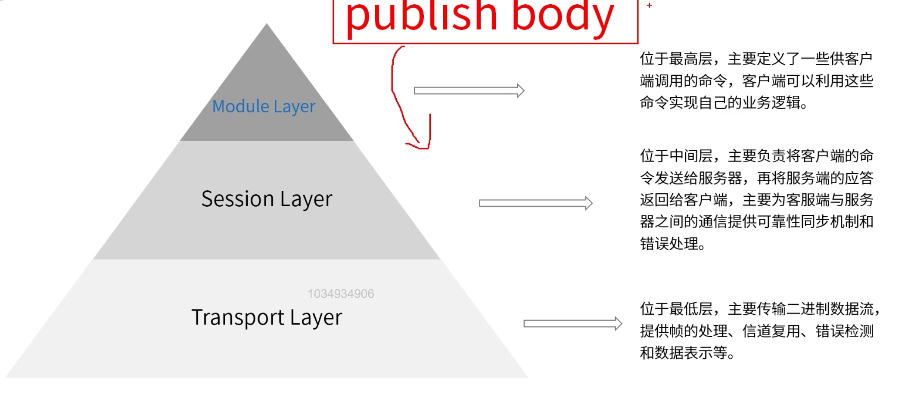

### AMQP生产者流转过程

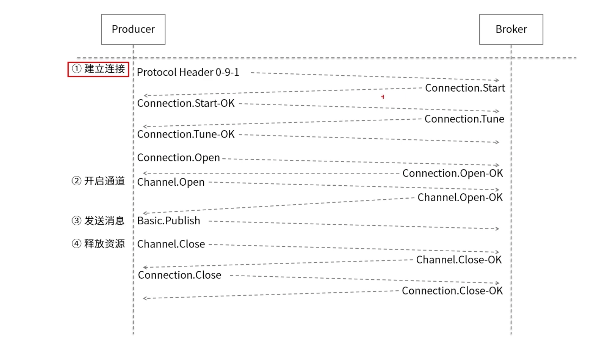

### AMQP消费者流转过程

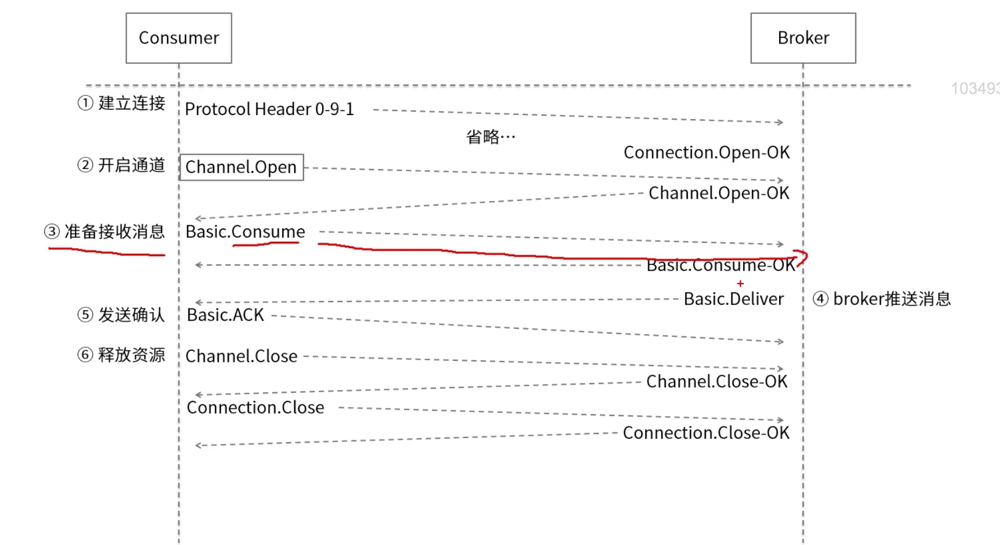

## RabbitMQ核心概念

### RabbitMQ整体架构

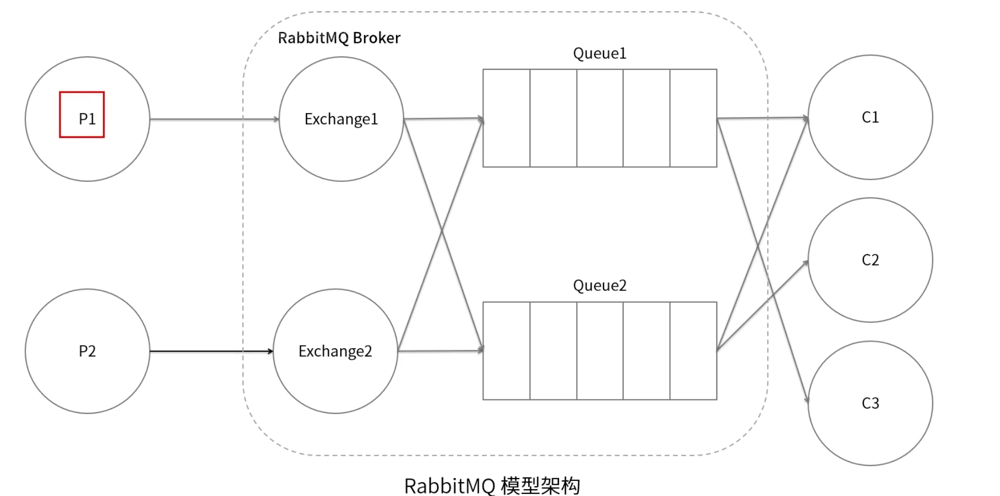

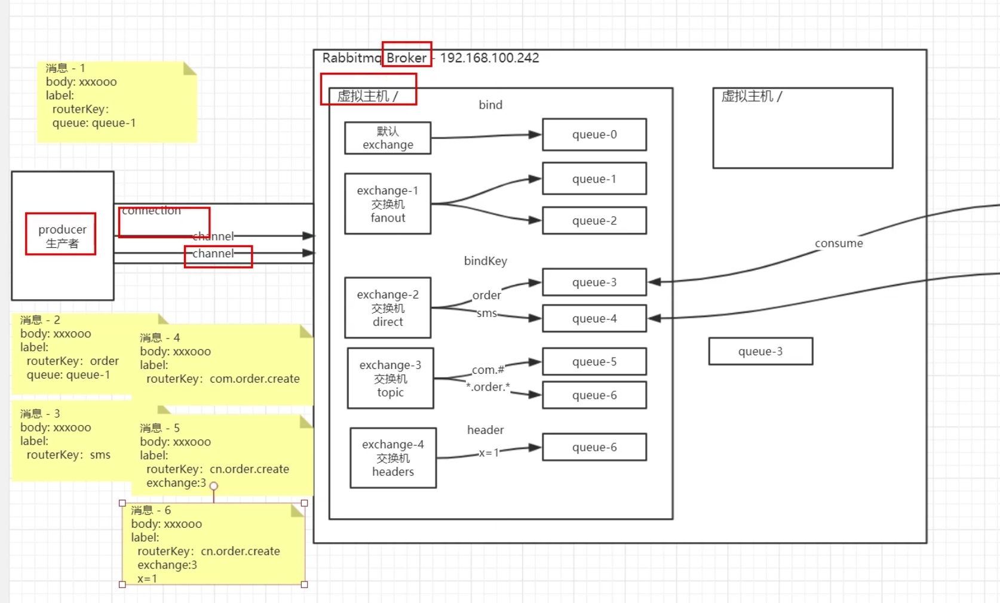

### Producer

1. 生产者，就是消息投递的一方。生产者创建消息，然后投递到RabbitMQ中。
2. 消息一般可以包含两个部分：消息体和附加信息。
   * 消息体，在实际应用中，消息体一般是一个带有业务逻辑结构的数据，比如一个JSON字符串。当然可以进一步对这个消息体进行序列化操作。
   * 附加信息，用来表述这条消息，比如目标交换器的名称，路由键和一些自定义属性等等。

### Broker

1. Broker：消息中间件的服务节点。
2. 对于RabbitMQ来说，一个RabbitMQ Broker可以简单地看作一个RabbitMQ服务节点，活着RabbitMQ服务实例。也可以将一个Broker看作一台RabbitMQ服务器。

### Virtual Host

1. Virtual Host：虚拟主机，表示一批交换器，消息队列和相关对象。虚拟主机是共享相同身份认证和加密环境的独立服务器域。
2. 每个vhost本质上就是一个mini版的RabbitMQ服务器，拥有自己队列，交换器，绑定和权限机制。vhost是AMQP概念的基础，必须在连接时指定，RabbitMQ默认的vhost是/。

### Channel

1. Channel，频道或信道，是建立在Connection连接之上的一种轻量级的连接。
2. 大部分的操作是在Channel这个接口中完成的，包括定义队列的声明queueDeclare，交换机的声明exchangeDeclare，队列的绑定queue，发布消息basicPublish，消费消息basicConsume等。
3. 如果把Connection比作一条光纤电缆的话，那么Channel信道就可以看作光纤电缆中的其中一束光纤。一个Connection上可以创建任意数量的Channel。

### RoutingKey

1. RoutingKey：路由键。生产者将消息发给路由器的时候一般会指定一个RoutingKey，用来指定这个消息的路由规则。
2. RoutingKey需要与交换器类型和绑定键(BindingKey)联合使用。在交换器类型和绑定键固定的情况下，生产者可以在发送消息给交换器时，通过指定RoutingKey来决定消息流向哪里。

### Exchange

1. Exchange：交换器，生产者将消息发送到Exchange(交换器)，由交换器将消息路由到一个或多个队列中。如果路由不到，或返回给生产者，或直接丢弃。

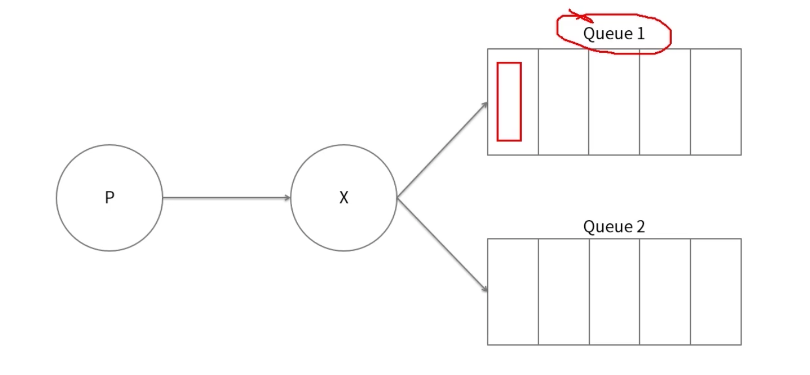

### Queue

1. Queue：队列，是RabbitMQ的内部对象，用于存储消息。

   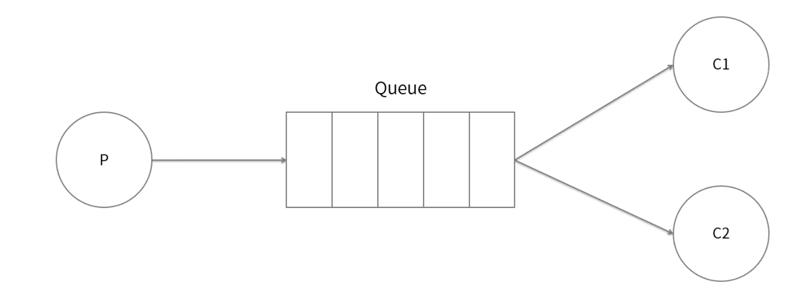

### Exchange类型

RabbitMQ常用的交换器类型有fanout，direct，topic，headers这四种。

1. Fanout：扇形交换器，它会把所有发送到该交换器的消息路由到所有与该交换器绑定的队列中。

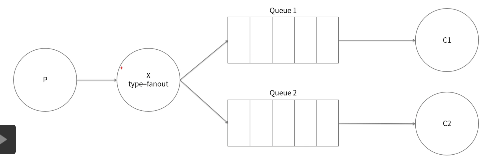

2. Direct：直连交换机，它会把消息路由到那些BindingKey和RoutingKey完全匹配的队列中。

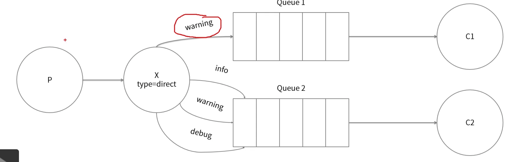

3. Topic：主题交换器，与direct类似，但它可以通过通配符进行模糊匹配。

   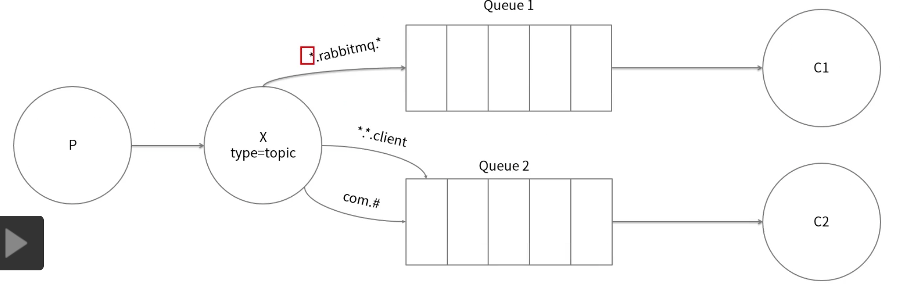

4. Headers：头交换器，不依赖于路由键的匹配规则来路由消息，而是根据发送消息内容中的headers属性来进行匹配。headers类型的交换器性能很差，而且也不实用。

### Consumer

1. Consumer：消费者，就是收到消息的一方。消费者连接到RabbitMQ服务器，并订阅到队列上。
2. 当消费者消费一条消息时，只是消费消息的消息体。在消息路由的过程中，消息的标签会丢弃，存入到队列中的消息只有消息体，消费者也只会消费到消息体，也就不知道消息的生产者是谁，当然消费者也不需要知道。

### 运转流程

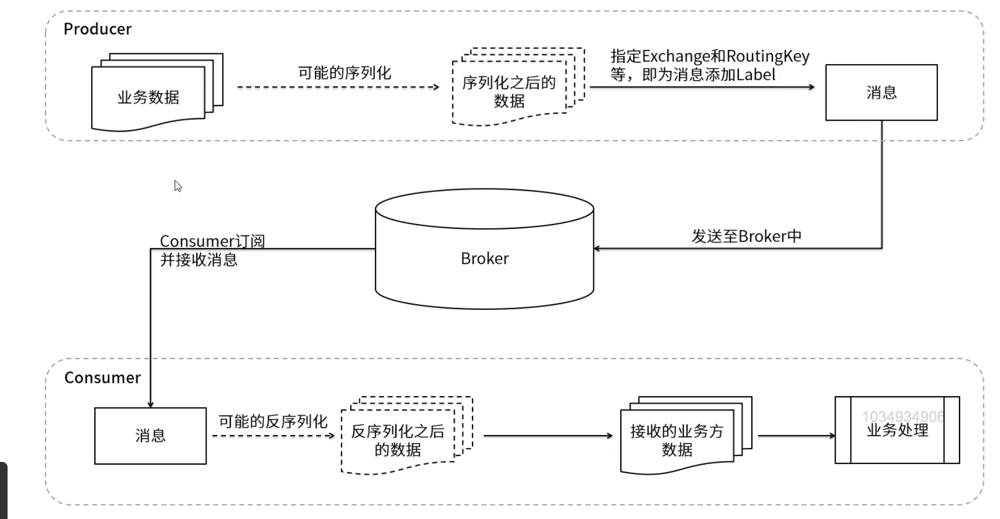

### RabbitMQ运转流程

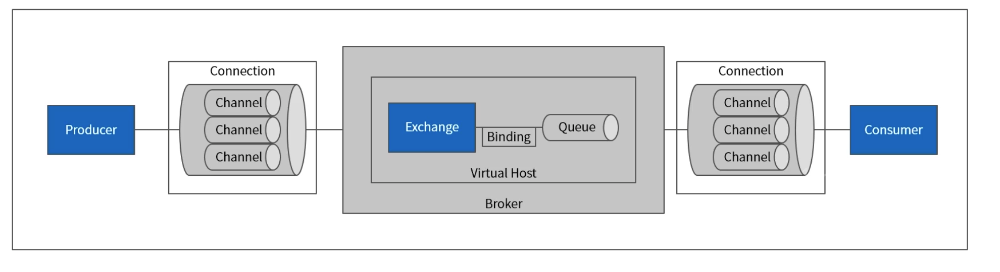

生产者发送消息的过程：

1. 生产者连接到RabbitMQ Broker，建立一个连接，开启信道。
2. 生产者声明一个交换器，并设置相关属性，比如交换器类型，是否持久化等。
3. 生产者声明一个队列并设置相关属性，比如是否排他，是否持久化，是否自动删除等。
4. 生产者通过路由键将交换器和队列绑定起来。
5. 生产者发送消息至RabbitMQ Broker，其中包含路由键，交换器等信息。
6. 相应的交换器根据接收到的路由键查找相匹配的队列。
7. 如果找到，则将从生产者发送过来的消息存入相应的队列中。
8. 如果没有找到，则根据生产者配置的属性选择丢弃还是回退给生产者。
9. 关闭信道，关闭连接。

消费者接受消息的过程：

1. 消费者连接到RabbitMQ Broker，建立一个连接，开启一个信道。
2. 消费者向RabbitMQ Broker请求消费相应对列中的消息，可能会设置相应的回调函数，以及做一些准备工作。
3. 等待RabbitMQ Broker回应并投递相应队列中的消息，消费者接受消息。
4. 消费者确认接受到的消息。
5. RabbitMQ从队列中删除相应已经被确认的消息。
6. 关闭信道，关闭连接。

