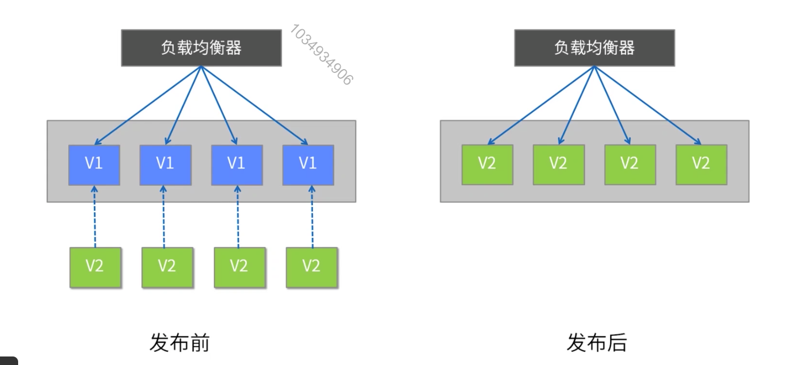
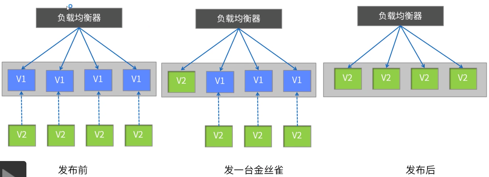
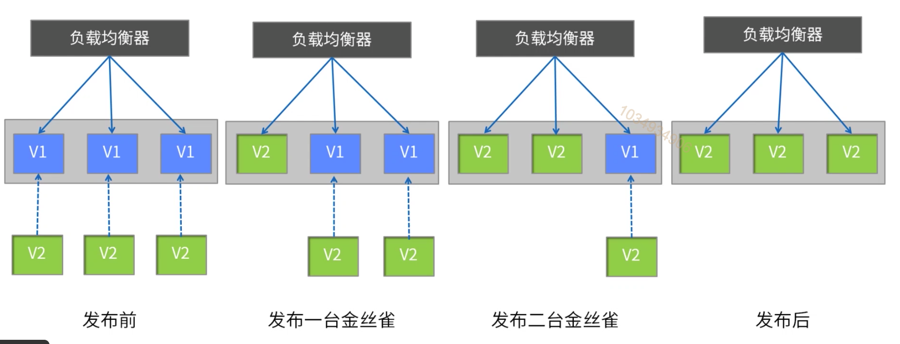
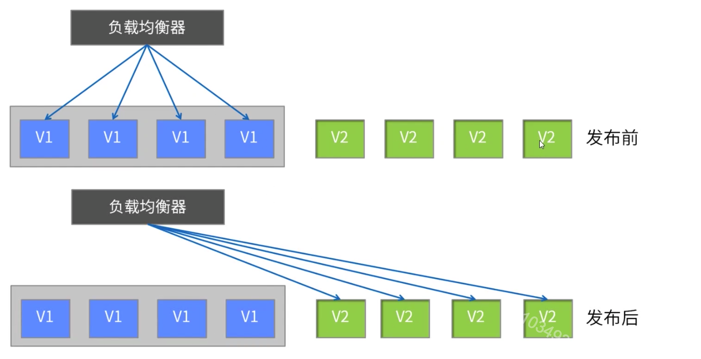
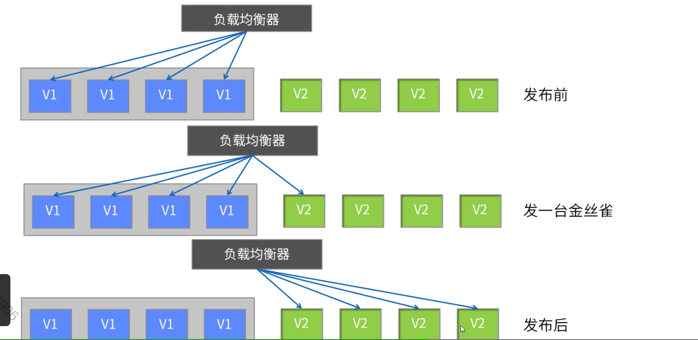
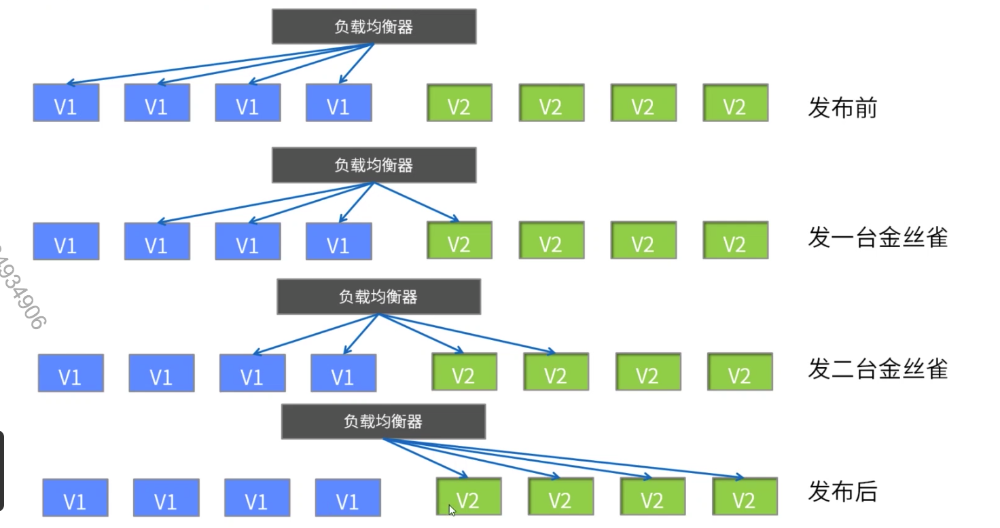
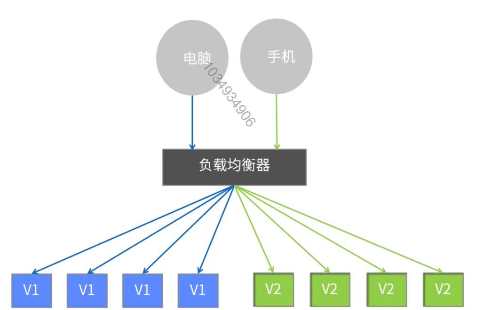
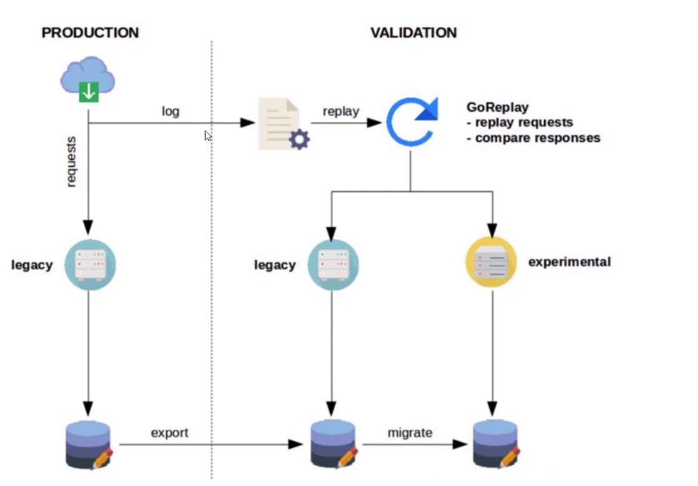

[TOC]

# 线上部署运维

### 单服务器组发布

早先机器资源比较紧张，不像现在云计算和虚拟化(包括容器技术)这么发达，所以应用机器基本是预先静态分配好的(一般由运维分配)，原来应用A在这n台机器上，那么下次升级发布的应用A也在这n台机器上，所以称为单服务器组发布方式。

#### 蛮力发布

1. 优势

   简单，成本低。

2. 不足

   服务中断用户受影响，出现问题回退比较慢。

3. 适用场景

   开发测试环境。

   非关键应用，用户影响面小。

   初创公司什么都缺，找夜深人静用户访问量小的时间解决。

#### 金丝雀发布

1. 优势

   用户体验影响小，金丝雀发布过程出现问题之影响少量用户。

2. 不足

   发布自动化程度不够，发布期间可引发服务中断。

3. 适用场合

   对新版本功能或性能缺乏足够信息。

   用户体验要求较高的网站业务场景。

   缺乏足够的自动化发布工具研发能力。

#### 滚动发布

1. 优势

   用户体验影响小，体验较平滑。

2. 不足

   发布和回退时间比较缓慢。

   发布工具比较复杂，LB需要平滑的流量摘除和拉入能力。

3. 适用场景

   用户体验不能中断的网站业务场景。

   有一定的复杂发布工具研发能力。

### 双服务器组发布

#### 蓝绿发布

1. 优势

   升级和回退速度非常快。

2. 不足

   切换是全量的，如果v2版本有问题，则对用户体验有直接影响。需要两倍机器资源。

3. 适用场景

   对用户体验有一定容忍度的场景。

   对机器资源有富余或者按需分配(AWS云，或自建容器云)。

   暂不具备复杂滚动发布工具研发能力。

#### 金丝雀发布

#### 滚动发布

### A/B测试

原来PC端和手机端都访问老版本V1服务(也称A组或控制组)，当V2新版本(也称B组或实验组)发布以后，为了验证V2的功能正确性，同时也为了避免V2有问题时影响所有用户，先通过LB将手机端的流量切花刀V2版本，经过一段时间的A/B对比测试和观察(主要通过用户和监控反馈)，确保V2正常，则通过LB将全部流量切换到V2。

基于LB方式实现A/B测试，LB需要能够通过某种条件做流量路由，例如通过client ip，设备类型，浏览器类型，甚至是定制的Http Header或查询字符串。

1. 优势

   用户体验影响小。

   可以使用生产流量测试。

   可以做到针对某类特定目标用户进行测试。

2. 不足

   搭建复杂度相对高，有一定技术门槛。

3. 适用场景

   核心关键业务，比如涉及资金的。

   具备一定的A/B测试平台研发能力。

### 影子测试

1. 优势

   对生产用户体验完全无影响。

2. 不足

   搭建复杂度很高，技术门槛高，数据库的导出复制是难点。

   外部依赖不能太多，否则测试部署成本很高，且对比测试更加复杂和不稳定。

3. 适用场景

   核心关键业务，比如涉及资金的。

   具备一定影子测试平台研发能力，包括流量复制，数据库导出复制和分发比对系统。