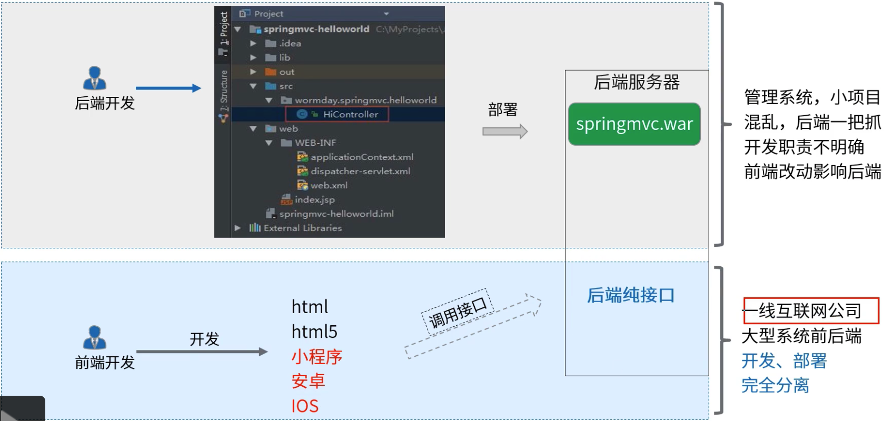
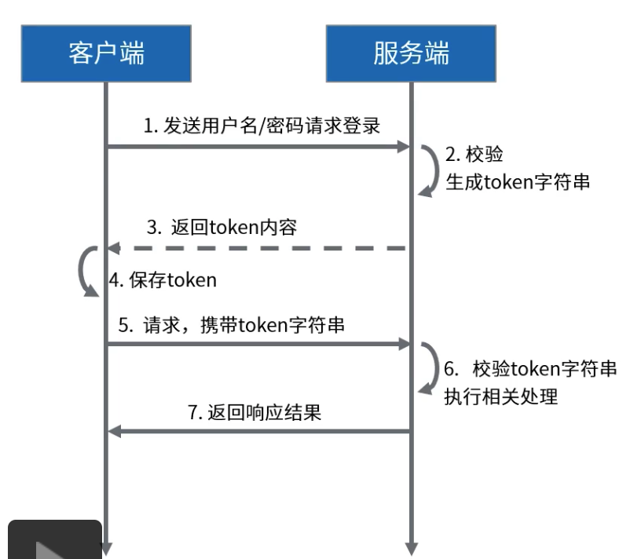
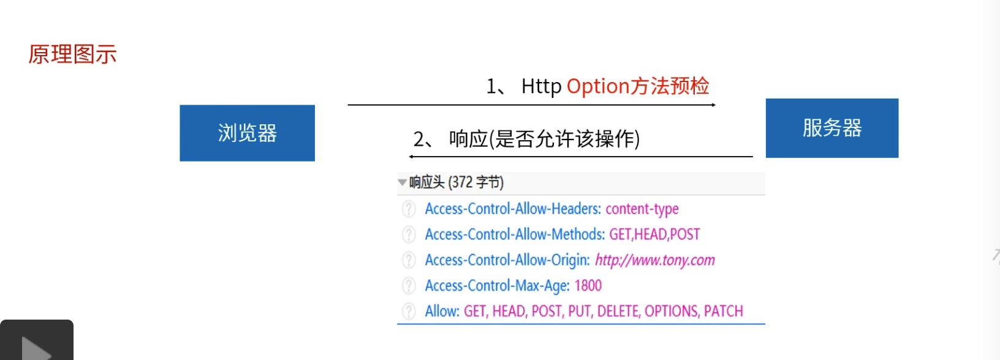

[TOC]

# 前后端分离

### 开发模式

### 不能再用session校验

不建议大规模使用的原因：

1. 要求在cookie中存储，cookie是http协议的内容。
2. app，小程序端对cookie支持有限。
3. session机制属于java web的底层实现，扩展session机制复杂。

### 采用Token方式

token是一个字符串，可以存在任何地方，不限制在cookie中，token的传递由自己实现，不受限任何协议。

那么：

1. 如何生成Token。
2. 如何传递Token。
3. 如何根据Token进行校验。
4. Token和session的安全性对比。

### 安全性论证

1. 有效期。

   Token内容中可以附带有效期，服务端依此判断token是否到期。

   服务端也应该提供刷新token的接口。

2. 盗取。

   和session的保护措施一样，通过https保证传输过程的安全性。

   客户端本身，通过安全控件。

3. 伪造/篡改。

   JWT的签名机制，能够有效防止数据被篡改和伪造。

   签名值只有服务端能计算出来，签名计算过程中添加了密码(盐值)。

### nginx实现页面分离部署

### 跨域问题

跨域脚本请求：浏览器打开a.com域的页面，你通过ajax post调用b.com或a.com的其他端口的时候，形成了跨域。

浏览器的同源安全策略，不允许发起这样的请求。

解决方案：

Jsonp，iframe，web服务器代理的方式(让页面和后端接口处于同一个域)，CORS跨域资源共享，主流的跨域解决方案。

