[TOC]

# Git

### 版本控制

1. 什么是版本控制。

   版本控制是指对软件开发过程中各种程序代码，配置文件及说明文档等文件变更的管理，是软件配置管理的核心思想之一。

### Git简介

1. Git是一个开源的分布式版本控制系统，用于敏捷高效地处理任何或小或大的项目。
2. Git是Linux Torvalds为了帮助管理Linux内核开发而开发的一个开放源码的版本控制软件。
3. Git与常用的版本控制工具CVS，Subversion等不同，它采用了分布式版本库的方式，不必服务器端软件支持。

### Git仓库

可以将git仓库简单理解为一个目录，该目录里面的所有文件均可被git管理起来，每个文件的修改，删除，git都能跟踪，以便任何时刻都可以追踪历史，或者在将来某个时刻可以"还原"。

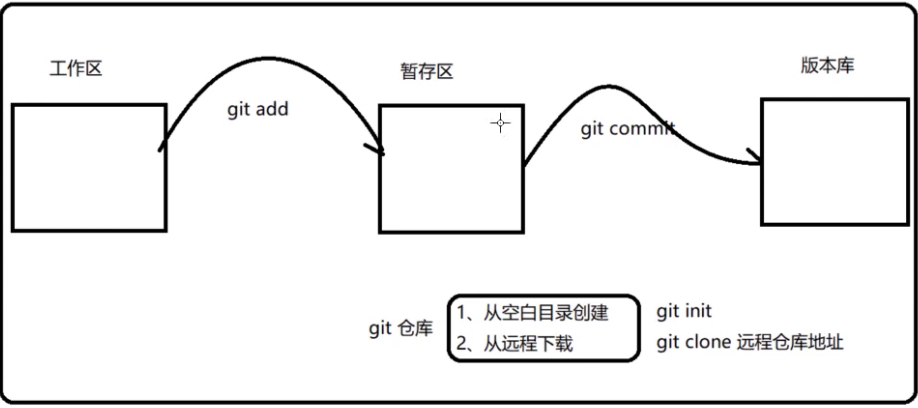

### Git基本操作

1. git config签名。
2. git init初始化仓库。
3. git add增加到暂存区。
4. git commit提交到版本库。
5. git status查看仓库状态。
6. git log查看提交日志。
7. git reflog查看提交日志的链表信息。
8. git reset —hard [索引]

### Git分支概念

Git和传统的版本控制工具最大的区别在于分支，学习分支才能说是真正掌握git的使用。其他版本控制工具都有分支管理，但是用过之后你会发现，这些版本控制系统创建和切换分支很慢，但是在git上，无论创建，切换和删除分支，Git都很快完成。

大多数版本控制系统在创建分支时，将所有的项目文件都复制一遍，并保存到一个特定的目录。完成这样的过程通常需要好几秒钟，有时甚至需要好几分钟，项目越大，所需时间越长。

在Git中，基于Git的数据存储方式，任何规模的项目都能在瞬间创建新分支，而且分支合并也同样的简单和快速。所以使用Git，鼓励频繁地创建和使用分支做不同的任务。

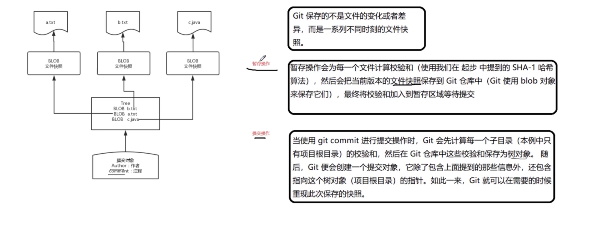

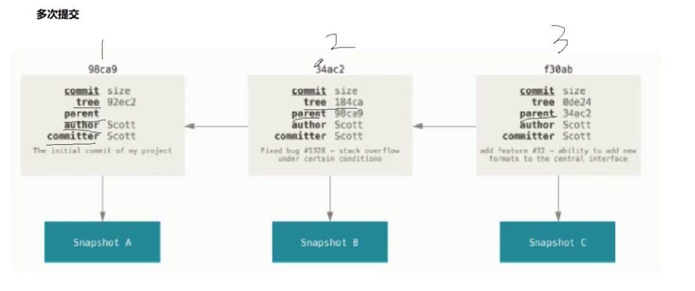

### Git分支原理解析

每次提交，Git会保存一个提交对象，多次提交之后，那么这次产生的提交兑现会包含一个指向上次提交兑现的指针。

每次提交，Git都把它们串成一条时间线。截止到目前，只有一条时间线，在Git里，这个分支叫主分支，是Git默认分支，与其它分支完全没有区别。

Git的分支，本质上是指向提交对象的可变指针。

存在一个名为HEAD的特殊指针，可以将HEAD想象为当前分支的别名，HEAD指向的就是当前分支。

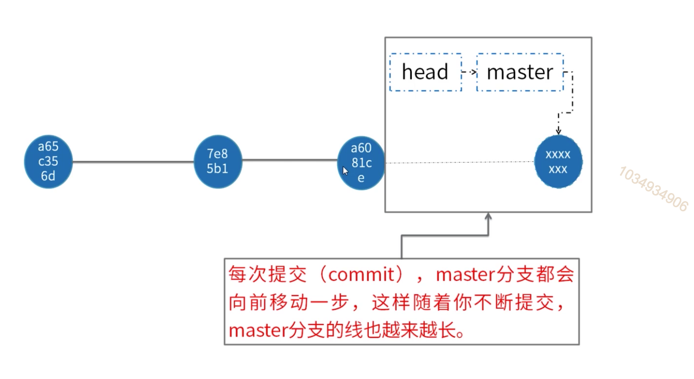

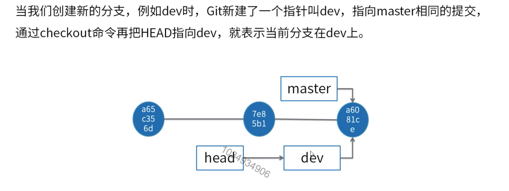

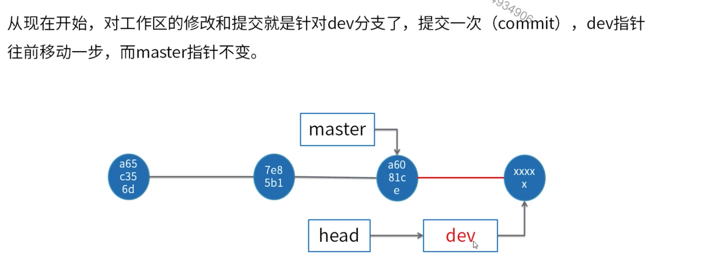

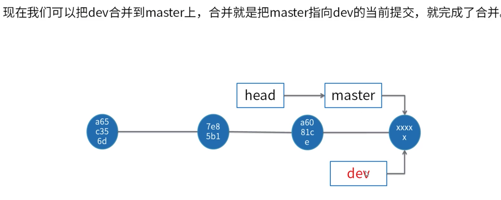

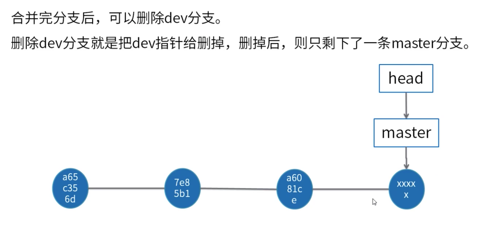

### Rebase与非Fast forward对比

1. 若想看仓库提交历史记录实际发生过什么，就算合并产生的提交历史是一团糟也没关系，需它是历史文档，不可随意修改，可随时查阅发生的事情，则采用非fast方式。
2. 若认为提交历史是项目过程中发生的事，只看结果，方便查阅，就用rebase。
3. 根据团队需求，建议对未推送给别人的本地修改执行变基操作清理历史，对已推送至别处的提交勿执行变基操作。

### 暂存分支

git stash 当程序出现bug时，需新建一个临时分支来修复，修复后合并分支，然后将临时分支删除，但是当前还在子分支上进行的工作还未提交，而且只开发到一半还无法提交。

### GitFlow理解

GitFlow是由Vincent Driessen提出的一个git操作流程标准，包含如下几个关键分支：

master：主分支，非常稳定的，不用来开发和发布，只用来跟踪已经发布的代码。

develop：主开发分支，包含确定即将发布的代码，开发都在这个分支，到发布时再合并到release上。

feature：新功能分支，一般一个新功能对应一个分支，对于功能的拆分需要比较合理，以避免一些后面不必要的代码冲突。

release：发布分支，发布时候用的分支，测试时候发现的bug直接在这个分支进行修复。

hotfix：紧急修复bug的时候用。

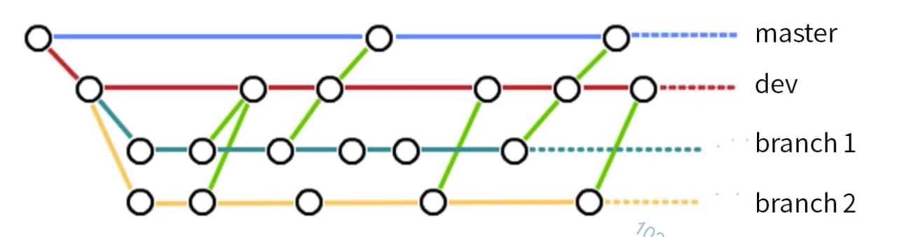

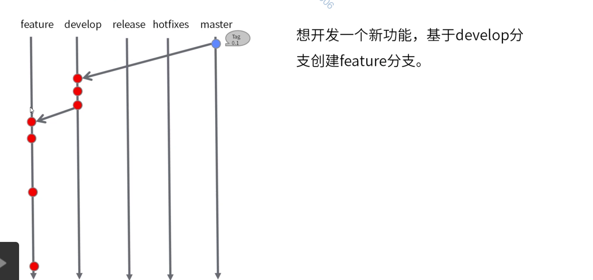

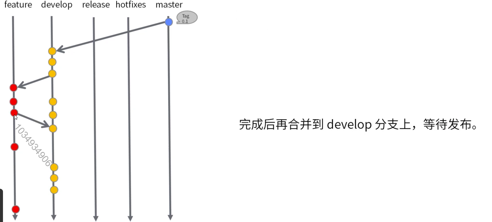

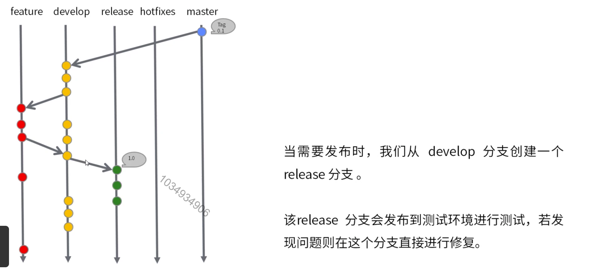

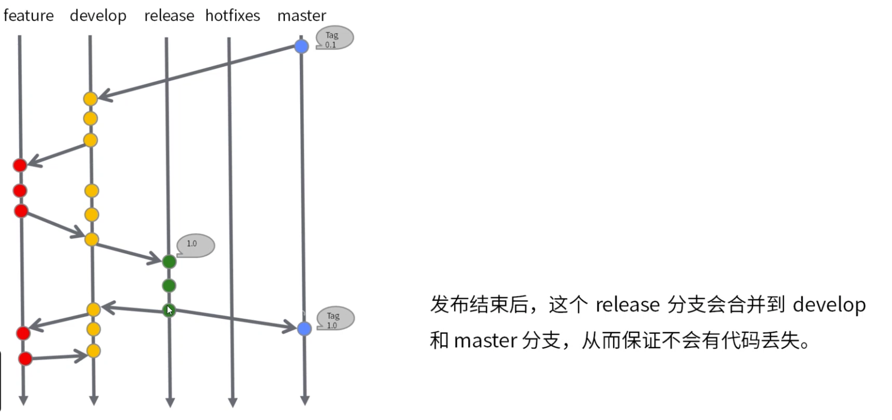

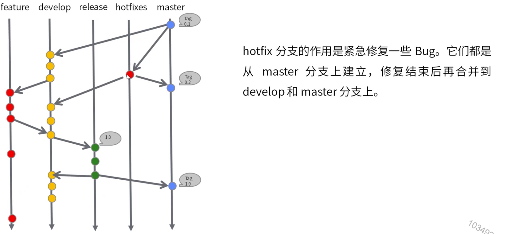

### 协同开发

