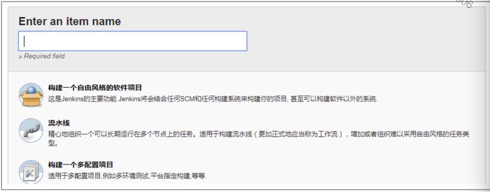
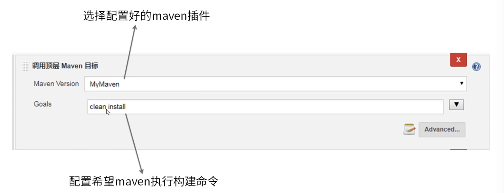
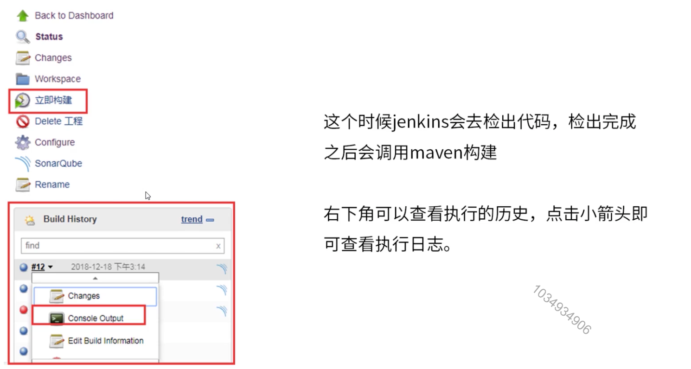
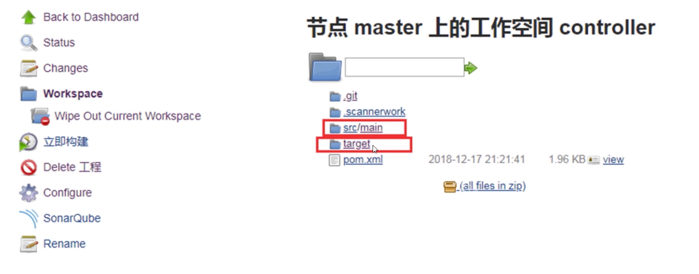
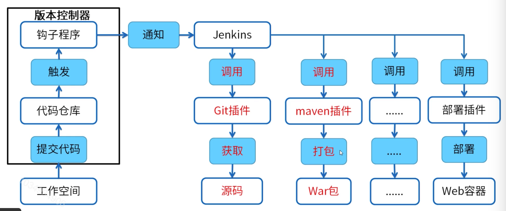
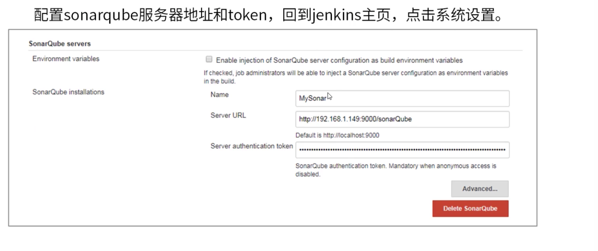
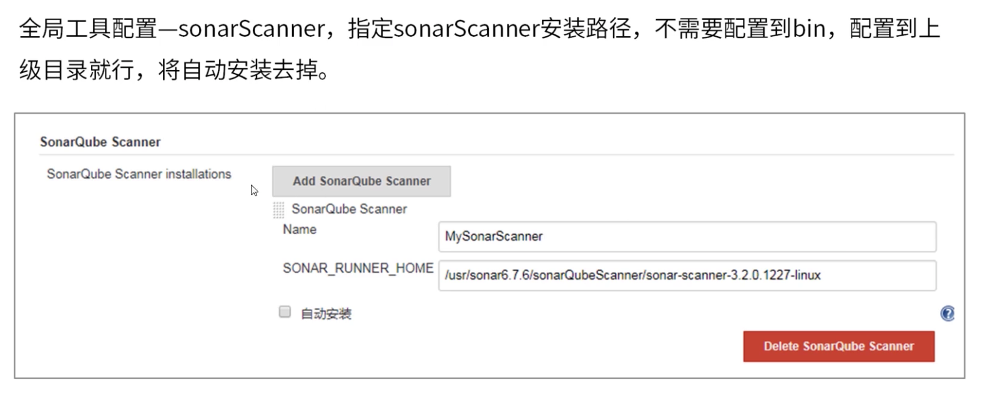
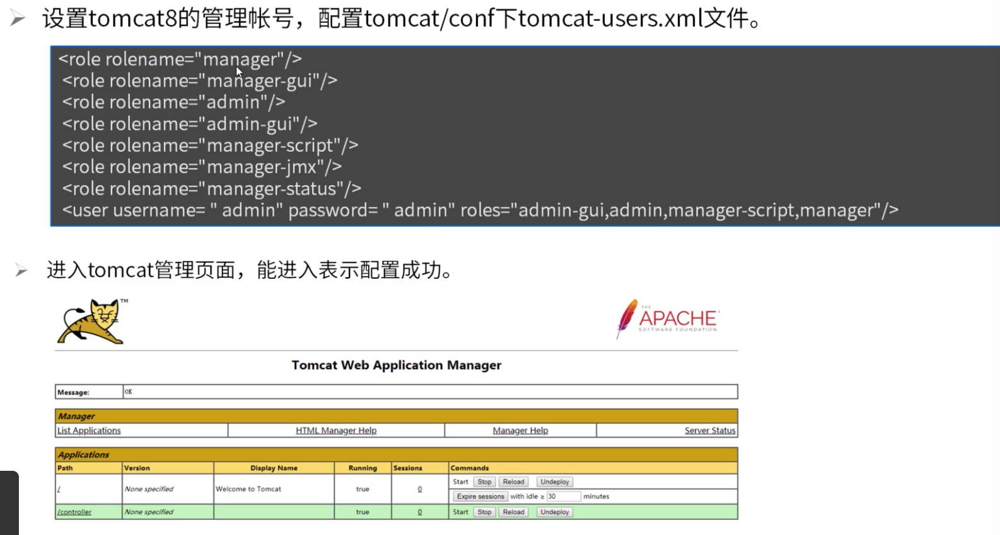
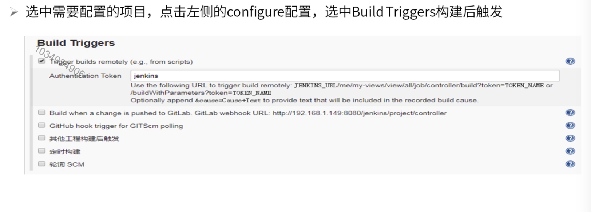

[TOC]

# Jenkins

### Jenkins简介

Jenkins是一个独立的开源自动化服务器，可用于自动执行与构建，测试，交付或部署软件相关的各种工具。

### 持续集成

1. 功能角度：类似maven生命周期，集成各种插件。Jenkins可以集成git，maven，sonar，部署插件等。
2. 项目角度 ：各个小组分别负责各个模块开发，本模块独立测试虽然能够通过，但是上线前将所有模块整合到一起集成测试却发现很多问题，想要解决就需要把代码返工重写，而且仍然可能有问题。那么经常性，频繁的把所有模块集成在一起进行测试，有问题尽早发现，这就是持续集成，目的是尽早发现项目整体运行问题，尽早解决。

### 持续交付

1. 功能角度：功能迭代迅速，持续发布，不需要等待一个大版本再发布。
2. 项目角度：项目的各个升级版本之间间隔如果时间太长，对用户反馈修改不及时，无法改善用户体验，用户流失严重。那么经常用小版本不断进行快速迭代，不断收集用户反馈信息，用最快的速度改进优化，目的是研发团队的最新代码能够尽快让最终用户体验到。

### Jenkins目标

1. 降低风险

   一天中进行多次的集成，并做了相应的测试，这样有利于检查缺陷。

2. 减少重复过程

   编译，测试，打包，部署等固定操作都必须要做，无法省略任何一个环节，而使用Jenkins等持续集成工具既可以把构建环节从手动完成转换为自动化完成。

3. 随时生成可部署的软件

   持续集成可以在随时发布可以部署的软件。利用持续集成，可以经常对源代码进行一些小的改动，并将这些改动和其它代码进行集成，如果出现问题，项目团队马上可以知晓，问题会第一时间被修复。不采用持续集成的情况下，这些问题有可能到交付前的集成测试的时候才发现，有可能导致延迟发布产品。

### Jenkins的优势

1. 配置简单

   是所有CI产品中在安装和配置上最简单的。

2. 用户体验

   基于web访问，用户界面非常友好，直观和灵活，在许多情况下，提供了AJAX的即使反馈。

3. Java相关：Jenkins是基于Java开发的，但它不仅限于构建基于Java的软件。

4. 应用便捷：Jenkins拥有大量的插件。这些插件极大地扩展了Jenkins的功能，且都是开源的，可以直接通过web界面来进行安装与管理。

### Jenkins新建项目

1. 配置好各种环境变量。

2. 新建一个自由风格项目。

   

### 配置Git

### 配置Maven

### Jenkins项目构建

### Jenkins编译war包

### Jenkins集成sonar

### Jenkins集成部署插件

### Jenkins配置钩子程序

Jenkins执行shell脚本启动Java程序。

