[TOC]

# Maven

 ### Maven介绍

Maven是Apache软件基金会组织维护的一款自动化构建工具，专注服务于Java平台的项目构建和依赖管理。

1. 项目构建。

   用Maven可以管理项目开发的整个生命周期，主要包括如下几个阶段：

   清理-编译-测试-报告-打包-安装-部署

2. 依赖管理。

   管理项目所依赖的所有Jar文件。

3. Maven能做什么。

   * 添加三方Jar包。
   * 管理Jar包之间的依赖关系。
   * 获取第三方jar包。
   * 将项目拆分成多个工程模块。

### 创建Maven项目

1. archetype:generate(交互模式)

2. archetype:generate(非交互模式)

   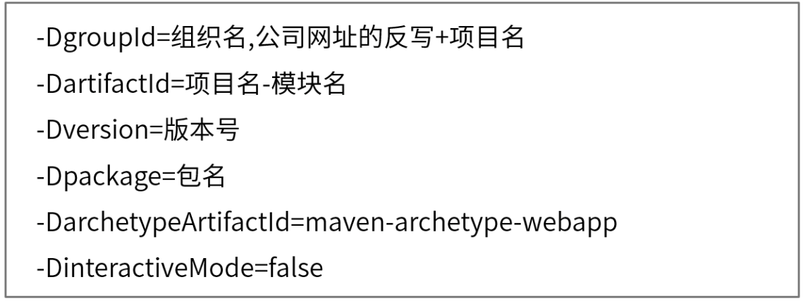

   

### Maven常用的构建命令

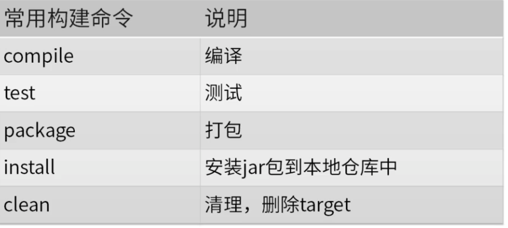

### 坐标和仓库

1. 坐标

   空间中的三维坐标，物理地址等都可以理解为坐标。

   构件的唯一标识符。

2. 仓库

   本地仓库：更改本地仓库的位置。

   远程仓库：中央仓库，私服，其他三方库。

### pom.xml文件

1. 项目的基础信息。

   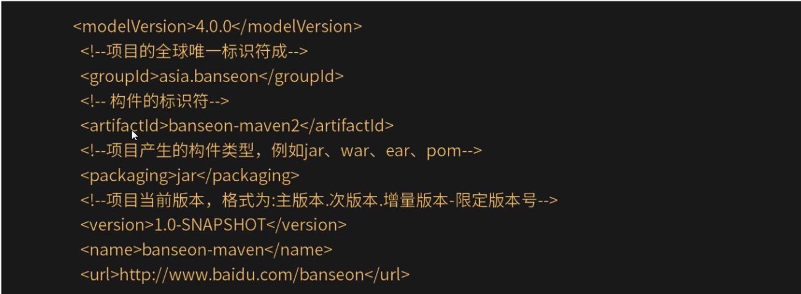

2. 项目的依赖信息。

   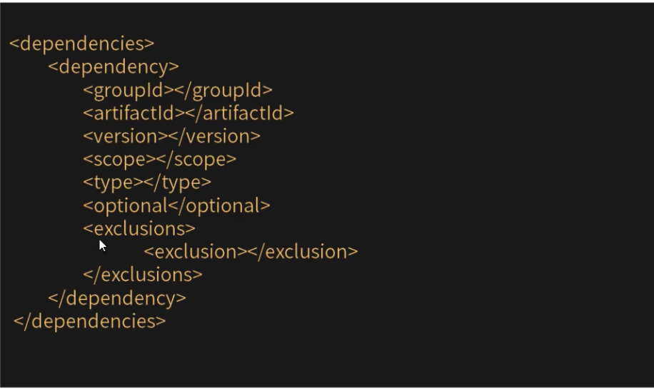

3. 项目的插件信息。

   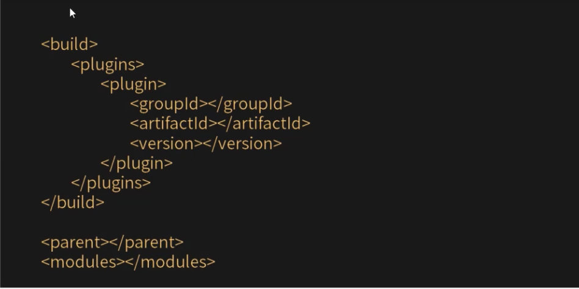

### 依赖范围

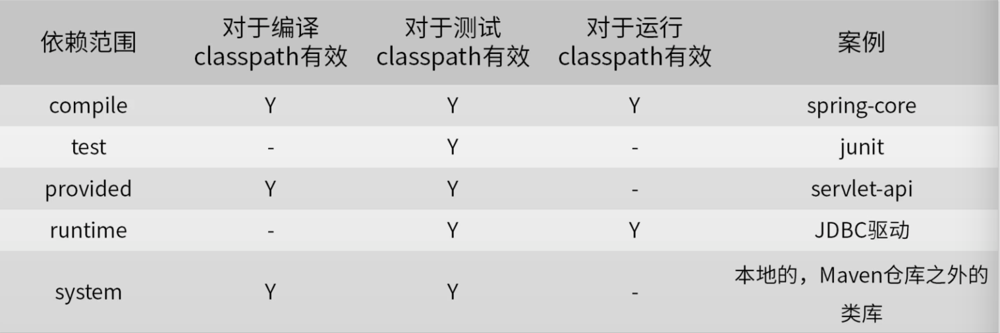

### 依赖传递

1. 依赖传递的基本概念。

   假如有Maven项目A，项目A依赖B，项目B依赖C，那么我们可以说A依赖于C，B是A的直接依赖，C是A的间接依赖。也就是说，依赖的关系为：A->B->C，那么我们执行项目A时，回自动把B，C都下载导入到A项目的jar包文件夹中，这就是依赖的传递性。

2. 依赖传递会引发依赖冲突。

### 依赖冲突

1. 依赖冲突产生的原因就是依赖传递。

2. 依赖冲突的解决方案。

   * 自己调解原则。

     先声明优先。

     短路优先。

   * 依赖排除。

   * 版本锁定。

### 生命周期管理概述

1. Mavne生命周期：生命周期是包含在一个项目中一系列有序的阶段。

   例如：验证->编译源码->编译测试源码->单元测试->打包->安装至本地仓库->复制到远程仓库等阶段都是属于生命周期。

2. Maven生命周期工作原理。

   生命周期中各个步骤的工作是插件来完成的。一个插件通常完成一个或多个步骤的工作，每个步骤的工作对应插件的一个目标。不同的插件结合起来，就可以完成整个项目的构件，例如：编译插件，compile；测试插件，surefire；打包插件，jar；安装插件，install；部署插件，deploy。

3. Maven生命周期分类：

   * Clean Lifecycle：清理项目。
     * pre-clean
     * clean
     * post-clean
   * Default Lifecycle：构建项目。
     * compile
     * test
     * package
     * Install
   * Site Lifecycle：生成项目站点。
     * pre-site：生成项目站点前要完成的工作。
     * site：生成项目的站点文档。
     * post-site：生成项目站点后要完成的工作。
     * site-deploy：发布生成的站点到服务器上。

### 插件管理

插件：生命周期各个阶段的实际工作者。

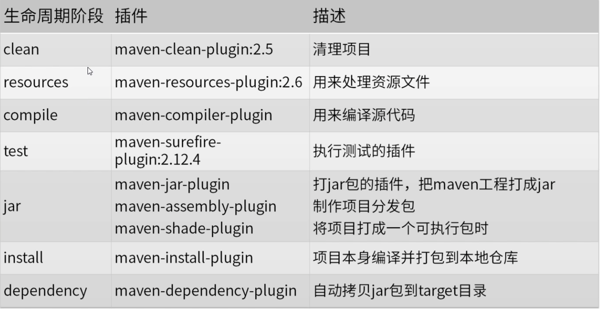

### 聚合

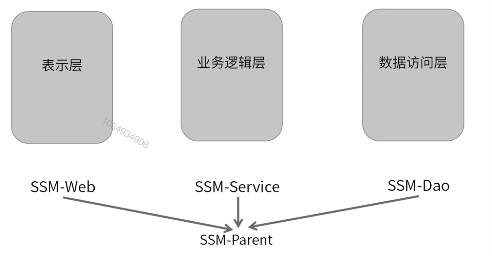

Maven聚合(或者称为多模块)，是为了能够使用一条命令就构建多个模块。

### 继承

1. 继承。

   继承为了消除重复，我们把很多相同的配置提取出来，例如：groupId，version等。

2. 继承配置。

   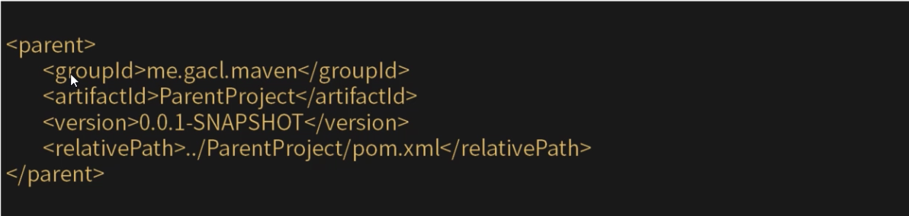

3. 聚合和继承的关系。

   聚合模块知道它聚合了哪些模块，但是被聚合的模块不知道聚合模块的存在。父模块不知道子模块的存在，但是子模块都必须知道自己的父模块是谁。

4. 聚合与继承的作用。

   通过Maven的聚合与继承特性，可以更加方便的管理和构建项目。

### 私服搭建

1. 私服搭建的必要性。

   * 公司开发的内部功能模块供公司内部团队使用。
   * 公司团队对某个功能共同维护。

2. 过程。

   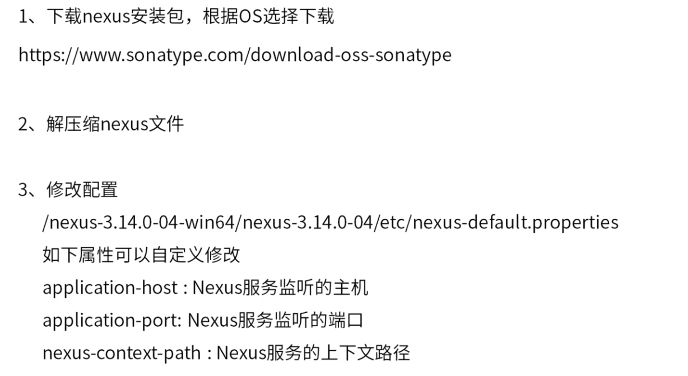

   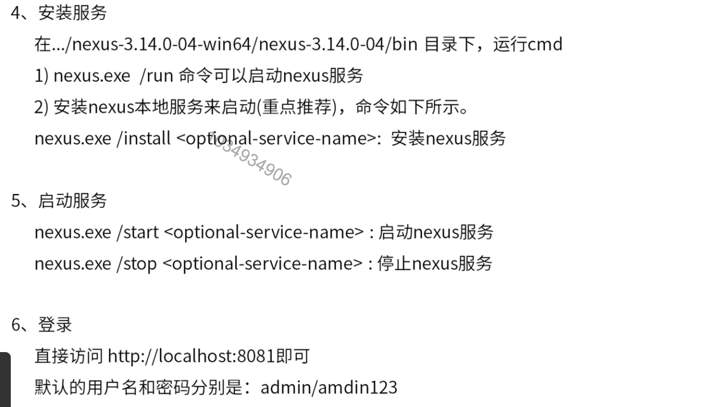

### Maven脚手架

1. archetype定义：是一个Maven项目模版工具包。
2. 常用archetype。
   * cocoon-22-archetype-weapp
   * maven-archetype-quickstart
   * maven-archetype-weapp
3. 开发。
   * 普通单模块项目的archetype开发
   * 多module的项目骨架archetype
   * 从现有的项目生成项目骨架archetype
   * 进入根目录。
   * 执行命令：mvn archetype:create-from-project
   * 进入根目录/target/generated-sources/archetype，执行mvn clean install安装到本地仓库。