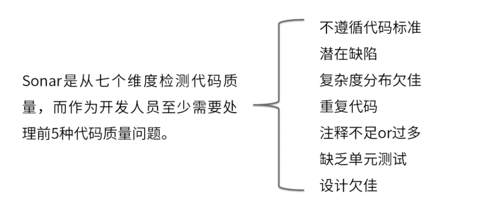
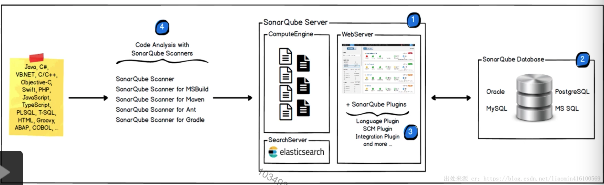
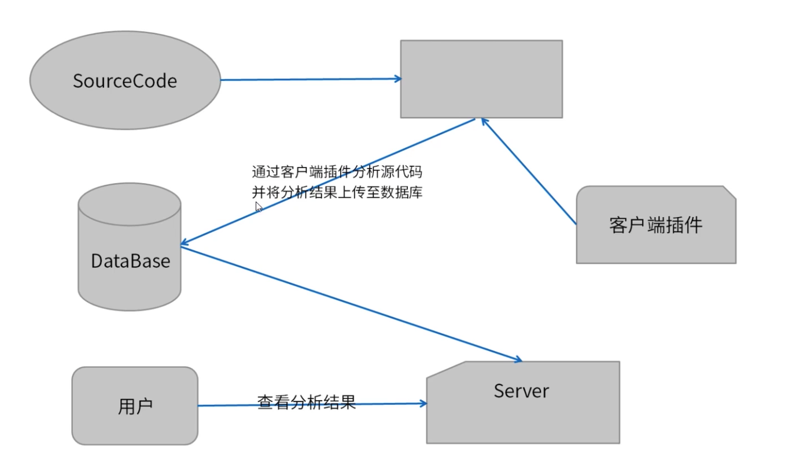
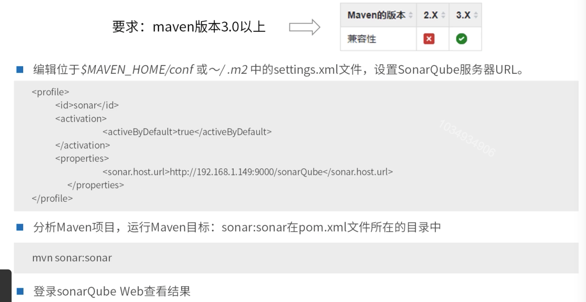

[TOC]

# Sonar

### Sonar简介

Sonar是一个用于代码质量管理的开源平台(管理源代码的质量)，通过插件的形式，可以支持包括java，C#，C/C++，PL/SQL，Cobol，JavaScript，Groovy等等二十几种编程语言的代码质量管理与检测。 

### SonarQube作用

1. 没有代码标准(不遵循代码标准)。

   sonar可以通过PMD，CheckStyle，Findbugs等等代码规则检测工具规范代码编写。

2. 潜在的bug，潜在的缺陷。

   sonar可以通过PMD，CheckStyle，Findbugs等等代码规则检测工具检测出潜在的bug。

3. 复杂度分布欠佳。

   文件，类，方法等，复杂度过高难以改变，使得开发人员难以理解它们，且如果没有自动化的单元测试，对于程序中的任何组件的改变都可能导致全面的回归测试。

4. 重复代码。

   程序中包含大量复制粘贴的代码是质量低下的，sonar可以展示源码中重复严重的地方。

5. 没有足够or过多的注释。

   没有注释将使代码的可读性变差，特别是当不可避免地出现人员变动时，程序的可读性将大幅下降，而过多的注释又会使得开发人员将精力过多地花费在阅读注释上。

6. 缺乏单元测试。

   sonar可以很方便地统计并展示单元测试覆盖率。

7. 设计欠佳。

   通过sonar可以找出循环，展示包与包，类与类之间的相互依赖关系，可以检测自定义的架构规则；通过sonar可以管理第三方的jar包，可以利用LCOM4检测单个任务规则的应用情况检测耦合。

   PMD，CheckStyle，Findbugs这些工具都叫静态代码分析工具。静态代码分析工具是指无需运行被测代码，仅通过分析或检查源程序的语法，结构，接口等检查程序的正确性，找出代码隐藏的错误或缺陷，如参数匹配，有歧义的嵌套语句，错误的递归，非法计算，空指针引用等。

### PMD

PMD是一种静态代码分析工具，能够自动检测范围很广的潜在缺陷和不安全或非优化的代码。其他工具，如Checkstyle可以检查编码约定和标准。PMD更侧重于缺陷检测(确保遵循良好做法)。它附带了丰富且高度可配置的规则集，可以轻松地配置给定项目应使用哪些特定规则。

1. 捕捉异常而不做任何事情。
2. 死循环代码。
3. 太多复杂的方法。
4. 直接使用实现而不是接口。
5. 实现或重写了hashcode()没有实现或重写equals方法。
6. 返回对可变对象的引用可能会对外暴露内部实现。

### Findbugs

Findbugs是Java的另一个静态分析工具，在某些方面类似于Checkstyle和PMD，但是具有不同的重点。

1. 不关心格式化或编码标准，它的目标是检测潜在的错误和性能问题(可以检测许多常见但难以发现的错误)。
2. 能够以比较高的精度检测出PMD或Checkstyle不同的问题。

### SonarQube优点

1. 优秀的图形化界面，基本上通过界面就可以对自己的项目代码一目了然。
2. 可以查询出其它软件难以定位到的问题。
   * 可能导致空指针异常的问题(对象在进行使用前没有加空的判断)。
   * 可能导致内存泄漏的问题：在try catch块里面，直接使用e.printStackTrace()将堆栈信息打印到内存。
   * 可能导致的漏洞：成员变量使用public定义。
   * 流等未关闭或者非正常关闭都能检测出来。

### Sonar组成

一个sonarqube服务器，包含三个子进程(web服务，搜索服务，计算引擎服务)。

一个sonarqube数据库，配置sonarqube服务。

多个sonarqube插件，位于解压目录extension\plugins目录。

一个或者多个sonarqube scanners用于分析特定的项目，相当于客户端。

### 使用SonarQube Maven插件分析代码

